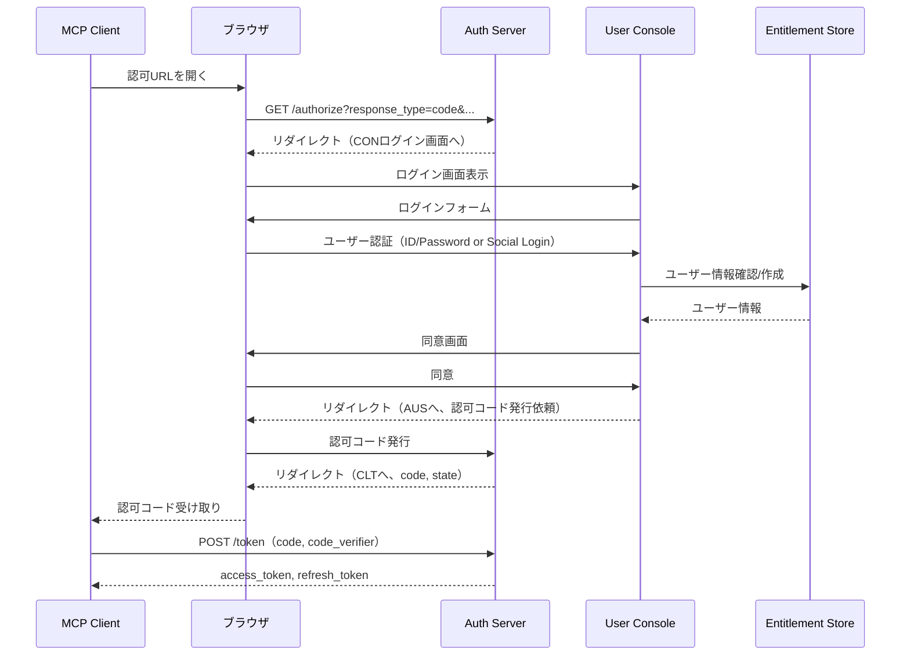

# Auth Server 詳細仕様書（spc-aus）

## ドキュメント管理情報

| 項目 | 値 |
|------|-----|
| Status | `draft` |
| Version | v1.0 (DAY8) |
| Note | OAuth 2.1 Authorization Server |

---

## 概要

Auth Server（AUS）は、OAuth 2.1準拠の認可サーバー。MCP ClientおよびUser Consoleに対してOAuth 2.1認証フローを提供する。

### 連携サマリー（spc-ariより）

| 相手                  | 方向         | やり取り                     |
| ------------------- | ---------- | ------------------------ |
| MCP Client          | AUS ← CLT | OAuth 2.1認証リクエスト受付       |
| MCP Server          | AUS ← SRV | JWKS公開鍵の提供（JWT検証用）       |
| Auth Middleware     | AUS ← AMW  | JWKS取得（公開鍵キャッシュ）         |
| MCP Handler         | -          | 直接やり取りなし                 |
| Module Registry     | -          | 直接やり取りなし                 |
| Modules             | -          | 直接やり取りなし                 |
| Entitlement Store   | AUS → ENT | ユーザー情報の参照・作成（OAuth登録時）   |
| Token Vault         | -          | 直接やり取りなし                 |
| User Console        | AUS ← CON | OAuth 2.1認証フロー（ユーザーログイン） |
| External API Server | -          | 直接やり取りなし                 |

---

## エンドポイント一覧

| エンドポイント | メソッド | 用途 |
|---------------|--------|------|
| `/.well-known/openid-configuration` | GET | OpenID Connect Discovery 1.0 メタデータ |
| `/.well-known/oauth-authorization-server` | GET | RFC 8414 OAuth 2.0 Authorization Server Metadata |
| `/authorize` | GET | 認可リクエスト（PKCE必須） |
| `/token` | POST | トークン交換・リフレッシュ |
| `/.well-known/jwks.json` | GET | JWT検証用公開鍵（JWKS） |

---

## 連携詳細

### CLT → AUS（MCP Client からの認可リクエスト）

| 項目 | 内容 |
|------|------|
| プロトコル | HTTPS |
| 認証方式 | OAuth 2.1 + PKCE |
| 参照仕様 | [OAuth 2.1](https://datatracker.ietf.org/doc/html/draft-ietf-oauth-v2-1-12), [RFC 7636 (PKCE)](https://datatracker.ietf.org/doc/html/rfc7636), [RFC 8707 (Resource Indicators)](https://datatracker.ietf.org/doc/html/rfc8707) |

MCP Clientからの認可リクエストを受け付け、ログイン・同意画面を経てaccess_tokenを発行する。

**実装方式:**

本システムでは、AUSは認可リクエストをUser Console（CON）にリダイレクトし、CONがログイン画面・同意画面を提供する。



**認可リクエスト（/authorize）:**

| パラメータ | 必須 | 説明 |
|-----------|------|------|
| response_type | Yes | `code`（認可コードフロー） |
| client_id | Yes | クライアント識別子 |
| redirect_uri | Yes | 認可コード返却先 |
| scope | Yes | 要求スコープ（`openid profile`等） |
| code_challenge | Yes | PKCE code_challenge（S256） |
| code_challenge_method | Yes | `S256` |
| state | Yes | CSRF対策用ランダム文字列 |
| resource | No | RFC 8707 Resource Indicator（`https://mcp.mcpist.app`） |

**トークンリクエスト（/token）:**

| パラメータ | 必須 | 説明 |
|-----------|------|------|
| grant_type | Yes | `authorization_code` または `refresh_token` |
| code | Yes* | 認可コード（authorization_code時） |
| redirect_uri | Yes* | 認可リクエスト時と同一（authorization_code時） |
| client_id | Yes | クライアント識別子 |
| code_verifier | Yes* | PKCE code_verifier（authorization_code時） |
| refresh_token | Yes* | リフレッシュトークン（refresh_token時） |
| resource | No | RFC 8707 Resource Indicator |

**トークンレスポンス:**

```json
{
  "access_token": "eyJ...",
  "token_type": "Bearer",
  "expires_in": 3600,
  "refresh_token": "..."
}
```

---

### CON → AUS（User Console からの認証リクエスト）

| 項目 | 内容 |
|------|------|
| プロトコル | HTTPS |
| 認証方式 | OAuth 2.1 + PKCE |
| 用途 | User Consoleへのユーザーログイン |

User ConsoleもAUSを使用してユーザー認証を行う。フローはCLT → AUSと同様。

---

### AMW → AUS（JWKS取得）

| 項目      | 内容                                              |
| ------- | ----------------------------------------------- |
| プロトコル   | HTTPS                                           |
| エンドポイント | `https://auth.mcpist.app/.well-known/jwks.json` |
| 用途      | JWT署名検証用公開鍵の取得                                  |
| キャッシュ   | 推奨（Cache-Controlヘッダーに従う）                        |

Auth MiddlewareはAUSからJWKSを取得し、MCP ClientからのJWTを検証する。

**JWKSレスポンス例:**

```json
{
  "keys": [
    {
      "kty": "RSA",
      "kid": "key-id-1",
      "use": "sig",
      "alg": "RS256",
      "n": "...",
      "e": "AQAB"
    }
  ]
}
```

---

### AUS → ENT（ユーザー情報の参照・作成）

| 項目 | 内容 |
|------|------|
| 方向 | AUS → ENT |
| 用途 | OAuth認証時のユーザー情報確認・新規作成 |
| トリガー | 初回ログイン時 or 認証成功時 |

初回ログイン時、Entitlement Storeにユーザーレコードを作成する（存在しない場合）。

---

## メタデータエンドポイント

### /.well-known/openid-configuration

[OpenID Connect Discovery 1.0](https://openid.net/specs/openid-connect-discovery-1_0.html) 準拠。

### /.well-known/oauth-authorization-server

[RFC 8414](https://datatracker.ietf.org/doc/html/rfc8414) 準拠。

両エンドポイントは同一のメタデータを返却する。MCP Clientの実装によりどちらかが使用されるため、両方を公開する。

**メタデータ例:**

```json
{
  "issuer": "https://auth.mcpist.app",
  "authorization_endpoint": "https://auth.mcpist.app/authorize",
  "token_endpoint": "https://auth.mcpist.app/token",
  "jwks_uri": "https://auth.mcpist.app/.well-known/jwks.json",
  "registration_endpoint": "https://auth.mcpist.app/oauth/register",
  "response_types_supported": ["code"],
  "grant_types_supported": ["authorization_code", "refresh_token"],
  "code_challenge_methods_supported": ["S256"],
  "token_endpoint_auth_methods_supported": ["none"],
  "scopes_supported": ["openid", "profile", "email"]
}
```

---

## JWT（access_token）仕様

| 項目 | 内容 |
|------|------|
| 形式 | JWT（JWS、RS256署名） |
| 有効期限 | 3600秒（1時間） |
| 検証 | JWKS公開鍵による署名検証 |

**JWTペイロード例:**

```json
{
  "iss": "https://auth.mcpist.app",
  "sub": "user-uuid",
  "aud": "https://mcp.mcpist.app",
  "exp": 1234567890,
  "iat": 1234564290,
  "scope": "openid profile"
}
```

| クレーム | 説明 |
|----------|------|
| iss | 発行者（Auth Server） |
| sub | ユーザー識別子（user_id） |
| aud | 対象リソース（MCP Server） |
| exp | 有効期限（Unix timestamp） |
| iat | 発行日時（Unix timestamp） |
| scope | 許可されたスコープ |

---

## AUSが直接やり取りしないコンポーネント

| コンポーネント | 理由 |
|----------------|------|
| MCP Handler (HDL) | MCP Server内部 |
| Module Registry (REG) | MCP Server内部 |
| Modules (MOD) | MCP Server内部 |
| Token Vault (TVL) | 外部サービストークン管理（AUSとは別領域） |
| External API Server (EXT) | Modules経由 |

---

## 関連ドキュメント

| ドキュメント | 内容 |
|-------------|------|
| [spc-sys.md](../spc-sys.md) | システム仕様書 |
| [spc-itr.md](../spc-itr.md) | インタラクション仕様書 |
| [itr-clt.md](./itr-clt.md) | MCP Client詳細仕様（CLT視点のOAuthフロー） |
| [itr-srv.md](./itr-srv.md) | MCP Server詳細仕様 |
