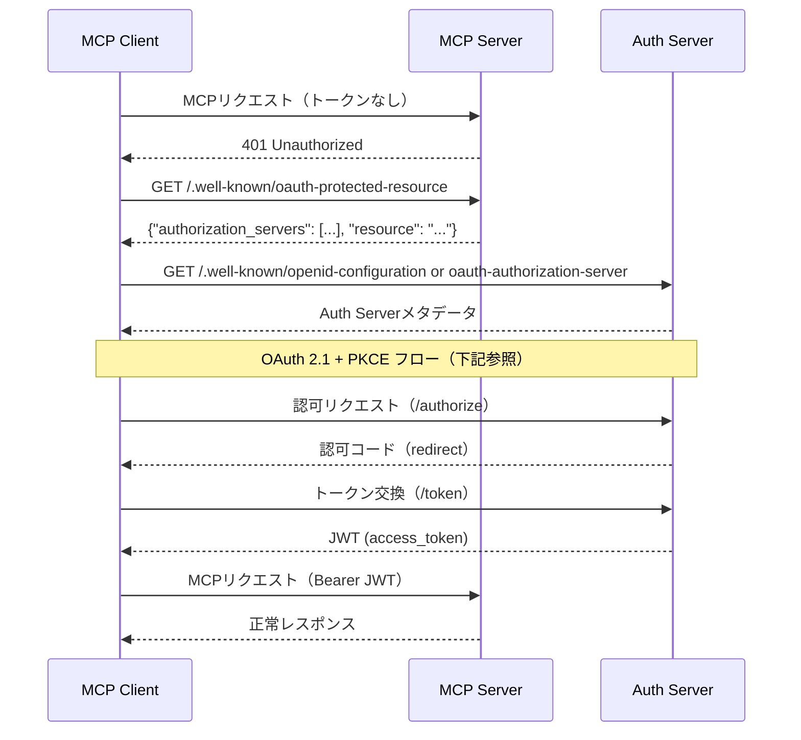
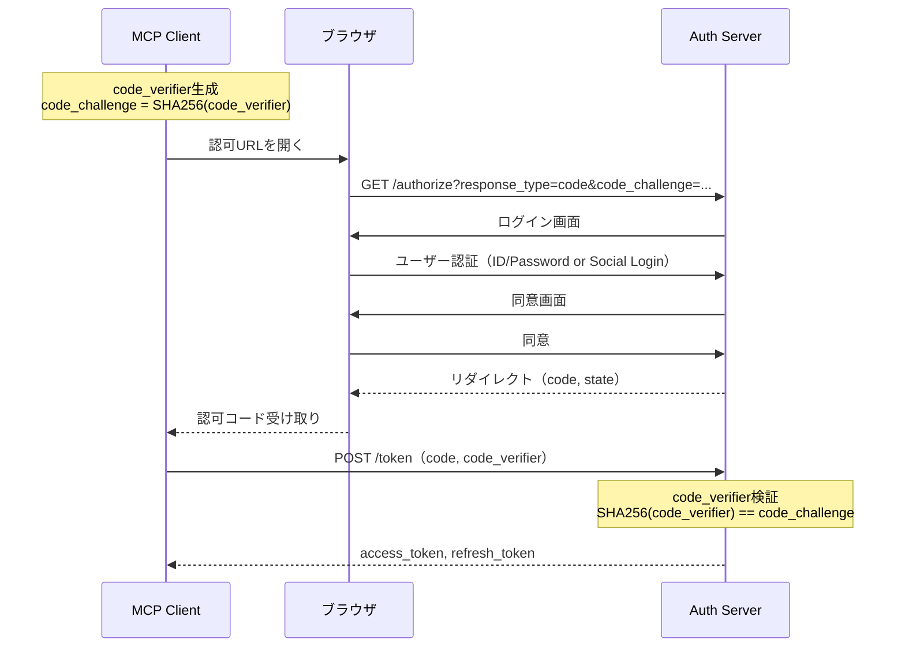

# MCP Client 詳細仕様書（spc-clt）

## ドキュメント管理情報

| 項目 | 値 |
|------|-----|
| Status | `draft` |
| Version | v1.0 (DAY8) |
| Note | 実装範囲外（参考情報） |

---

## 概要

MCP Client（CLT）は、LLM Host（Claude Code, Cursor等）からMCP Serverへ接続するクライアント。

**実装範囲外**だが、他コンポーネントとのやり取りを明確にするため仕様を記載する。

### 連携サマリー（spc-ariより）

| 相手                  | 方向        | やり取り                                                            |
| ------------------- | --------- | --------------------------------------------------------------- |
| Auth Server         | CLT → AUS | OAuth 2.1認証フロー（認可コード取得、トークン交換）                                  |
| MCP Server          | CLT → SRV | MCP Protocol（JSON-RPC over SSE）<br>初回認可フロー開始（401 → .well-known） |
| Auth Middleware     | -         | 直接やり取りなし（MCP Server経由）                                          |
| MCP Handler         | -         | 直接やり取りなし（MCP Server経由）                                          |
| Module Registry     | -         | 直接やり取りなし（MCP Server経由）                                          |
| Modules             | -         | 直接やり取りなし（MCP Server経由）                                          |
| Entitlement Store   | -         | 直接やり取りなし                                                        |
| Token Vault         | -         | 直接やり取りなし                                                        |
| User Console        | -         | 直接やり取りなし                                                        |
| External API Server | -         | 直接やり取りなし                                                        |

---

## 連携詳細

### 初回認可フロー（CLT → SRV → AUS）

| 項目 | 内容 |
|------|------|
| 参照仕様 | [MCP Authorization](https://modelcontextprotocol.io/specification/draft/basic/authorization), [RFC 9728](https://datatracker.ietf.org/doc/html/rfc9728), [RFC 8707](https://datatracker.ietf.org/doc/html/rfc8707) |
| トリガー | CLTがトークンなしでSRVへリクエスト |
| 前提条件 | SRVが401を返却し、.well-known/oauth-protected-resourceを公開 |
| 成功時 | CLTがaccess_token（JWT）を取得 |
| 失敗時 | 認可フロー中断、CLTはMCPサービス利用不可 |

MCP仕様に従い、初回認可はSRVを経由して開始される。



**フローの説明:**

1. CLT → SRV: MCPリクエスト（トークンなし）
2. SRV → CLT: 401 Unauthorized
3. CLT → SRV: GET /.well-known/oauth-protected-resource（RFC 9728）
4. SRV → CLT: Authorization Serverの情報を返却
   ```json
   {
     "authorization_servers": ["https://auth.mcpist.app"],
     "resource": "https://mcp.mcpist.app"
   }
   ```
5. CLT → AUS: Auth Serverメタデータ取得（下記2種類のいずれか）
6. AUS → CLT: Auth Serverメタデータ返却
   ```json
   {
     "issuer": "https://auth.mcpist.app",
     "authorization_endpoint": "https://auth.mcpist.app/authorize",
     "token_endpoint": "https://auth.mcpist.app/token",
     "jwks_uri": "https://auth.mcpist.app/.well-known/jwks.json",
     "code_challenge_methods_supported": ["S256"]
   }
   ```
7. CLT → AUS: OAuth 2.1 + PKCE フロー開始（下記参照）
8. AUS → CLT: JWT (access_token) 発行
9. CLT → SRV: MCPリクエスト（JWT付き）

**Auth Serverメタデータエンドポイント（AUSは両方を公開）:**

| エンドポイント | 仕様 |
|---------------|------|
| `https://auth.mcpist.app/.well-known/openid-configuration` | [OpenID Connect Discovery 1.0](https://openid.net/specs/openid-connect-discovery-1_0.html) |
| `https://auth.mcpist.app/.well-known/oauth-authorization-server` | [RFC 8414 - OAuth 2.0 Authorization Server Metadata](https://datatracker.ietf.org/doc/html/rfc8414) |

CLTの実装によりどちらかが使用されるため、AUSは両方で同一のメタデータを公開する。

---

### CLT → AUS（Auth Server）

本セクションは、AUSが実装範囲内のため、外部仕様（OAuth 2.1, RFC 7636）をあえて説明するものである。

| 項目 | 内容 |
|------|------|
| プロトコル | HTTPS |
| 認証方式 | OAuth 2.1 + PKCE |
| やり取り | 認可コード取得、トークン交換 |
| 参照仕様 | [OAuth 2.1](https://datatracker.ietf.org/doc/html/draft-ietf-oauth-v2-1-12), [RFC 7636 (PKCE)](https://datatracker.ietf.org/doc/html/rfc7636) |



**OAuth 2.1 + PKCE フロー詳細:**

```
1. CLT: 認可リクエスト
   GET /authorize
     ?response_type=code
     &client_id={client_id}
     &redirect_uri={redirect_uri}
     &scope=openid profile
     &code_challenge={code_challenge}
     &code_challenge_method=S256
     &state={state}
     &resource=https://mcp.mcpist.app  ← RFC 8707 Resource Indicator

2. AUS: 認可コード返却（リダイレクト）
   {redirect_uri}?code={code}&state={state}

3. CLT: トークン交換
   POST /token
     grant_type=authorization_code
     &code={code}
     &redirect_uri={redirect_uri}
     &client_id={client_id}
     &code_verifier={code_verifier}
     &resource=https://mcp.mcpist.app

4. AUS: トークン返却
   {
     "access_token": "eyJ...",
     "token_type": "Bearer",
     "expires_in": 3600,
     "refresh_token": "..."
   }
```

**CLTが保持するデータ:**
- `access_token`: MCP Server へのリクエストに使用
- `refresh_token`: トークン更新に使用
- `expires_in`: トークン有効期限

---

### CLT → SRV（MCP Server）

| 項目 | 内容 |
|------|------|
| プロトコル | [MCP Protocol 2025-11-25](https://modelcontextprotocol.io/specification/2025-11-25)（JSON-RPC 2.0 over Streamable HTTP） |
| 認証 | Bearer Token（JWT） |
| エンドポイント | `https://mcp.mcpist.app/mcp` |
| 参照仕様 | [MCP Transports](https://modelcontextprotocol.io/specification/2025-11-25/basic/transports) |

**リクエストヘッダー:**
```
Authorization: Bearer {access_token}
Content-Type: application/json
Accept: application/json, text/event-stream
MCP-Protocol-Version: 2025-11-25
MCP-Session-Id: {session_id}  # 初回以降必須
```

**MCPプリミティブ:**

| プリミティブ | メソッド | 用途 | 参照 |
|-------------|----------|------|------|
| Tools | `tools/list`, `tools/call` | 実行可能な関数の公開 | [Tools](https://modelcontextprotocol.io/specification/2025-11-25/server/tools) |
| Resources | `resources/list`, `resources/read` | コンテキストデータの共有 | [Resources](https://modelcontextprotocol.io/specification/2025-11-25/server/resources) |
| Prompts | `prompts/list`, `prompts/get` | テンプレートメッセージ | [Prompts](https://modelcontextprotocol.io/specification/2025-11-25/server/prompts) |

**tools/list リクエスト例:**
```json
{
  "jsonrpc": "2.0",
  "id": 1,
  "method": "tools/list"
}
```

**tools/call リクエスト例（メタツール経由）:**
```json
{
  "jsonrpc": "2.0",
  "id": 2,
  "method": "tools/call",
  "params": {
    "name": "call",
    "arguments": {
      "module": "notion",
      "tool": "search",
      "params": {
        "query": "設計ドキュメント"
      }
    }
  }
}
```

メタツールの詳細は [dsn-module-registry.md](../../DAY7/dsn-module-registry.md) を参照。

---

## CLTが直接やり取りしないコンポーネント

| コンポーネント                   | 理由           |
| ------------------------- | ------------ |
| Auth Middleware (AMW)     | MCP Server内部 |
| MCP Handler (HDL)         | MCP Server内部 |
| Module Registry (REG)     | MCP Server内部 |
| Modules (MOD)             | MCP Server内部 |
| Entitlement Store (ENT)   | サーバー側データストア  |
| Token Vault (TVL)         | サーバー側データストア  |
| User Console (CON)        | 別アプリケーション    |
| External API Server (EXT) | Modules経由    |

---

## 関連ドキュメント

| ドキュメント | 内容 |
|-------------|------|
| [spc-sys.md](../spc-sys.md) | システム仕様書 |
| [spc-itr.md](../spc-itr.md) | インタラクション仕様書 |
| [itr-aus.md](./itr-aus.md) | Auth Server詳細仕様 |
| [itr-srv.md](./itr-srv.md) | MCP Server詳細仕様 |
