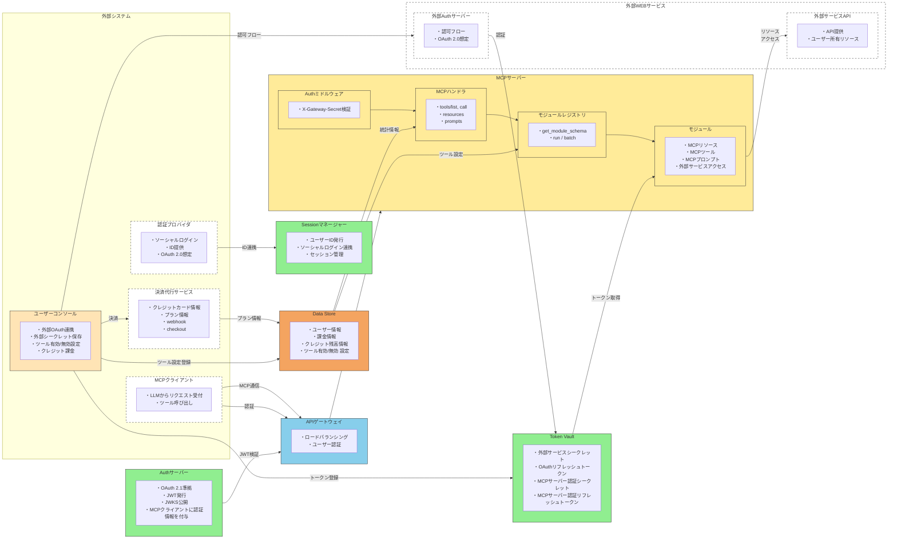

# MCPist システム構成図

## システムアーキテクチャ

## コンポーネント説明

### 外部システム（点線枠）

| コンポーネント | 説明 |
|---------------|------|
| MCPクライアント | LLMからリクエストを受け付け、ツール呼び出しを行う |
| 認証プロバイダ | ソーシャルログイン、ID提供（OAuth 2.0） |
| 決済代行サービス | クレジットカード情報、プラン情報、webhook、checkout |
| 外部WEBサービス | 外部Authサーバー（認可フロー）、外部サービスAPI（リソース提供） |

### 内部システム

| コンポーネント | 色 | 説明 |
|---------------|-----|------|
| ユーザーコンソール | オレンジ | OAuth連携、シークレット保存、ツール設定、課金管理 |
| APIゲートウェイ | 青 | ロードバランシング、ユーザー認証 |
| Sessionマネージャー | 緑 | ユーザーID発行、ソーシャルログイン連携、セッション管理 |
| Authサーバー | 緑 | OAuth 2.1準拠、JWT発行、JWKS公開 |
| Token Vault | 緑 | 外部サービスシークレット、OAuthトークン管理 |
| Data Store | オレンジ/赤 | ユーザー情報、課金情報、クレジット残高、ツール設定 |
| MCPサーバー | 黄色 | Authミドルウェア、MCPハンドラ、モジュールレジストリ、モジュール |

## データフロー

1. **MCP通信**: MCPクライアント → APIゲートウェイ → MCPサーバー
2. **認証フロー**: MCPクライアント → APIゲートウェイ（認証）、認証プロバイダ → Sessionマネージャー（ID連携）
3. **JWT検証**: Authサーバー → APIゲートウェイ
4. **課金フロー**: ユーザーコンソール → 決済代行サービス → Data Store（プラン情報）
5. **外部サービス連携**: ユーザーコンソール → 外部Authサーバー → Token Vault → モジュール → 外部サービスAPI
6. **ツール設定**: ユーザーコンソール → Data Store → モジュールレジストリ/MCPハンドラ
