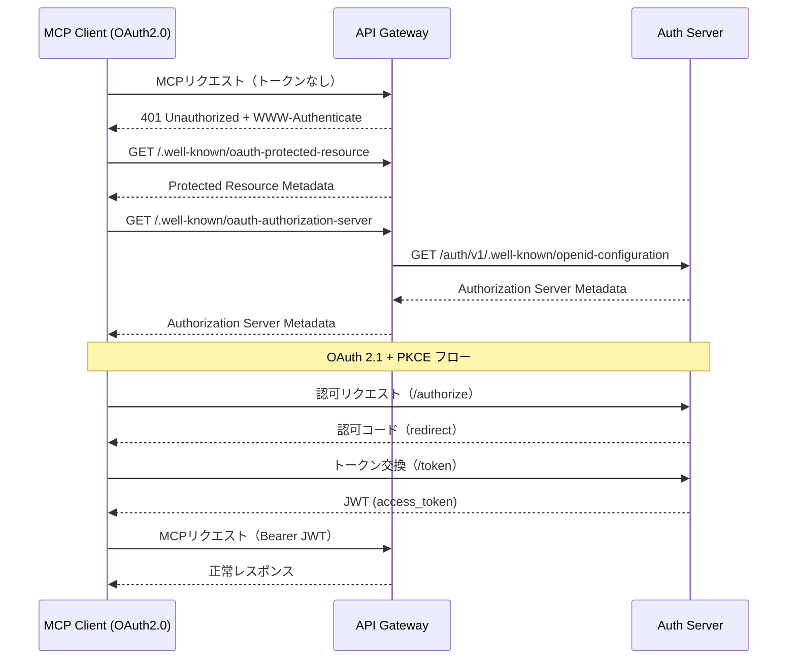

# AUS - CLO インタラクション詳細（dtl-itr-AUS-CLO）

## ドキュメント管理情報

| 項目      | 値                                                      |
| ------- | ------------------------------------------------------ |
| Status  | `reviewed`                                             |
| Version | v2.0                                                   |
| Note    | Auth Server - MCP Client (OAuth2.0) Interaction Detail |

---

## 概要

| 項目 | 内容 |
|------|------|
| 連携元 | MCP Client (OAuth2.0) (CLO) |
| 連携先 | Auth Server (AUS) |
| 内容 | OAuth認可 |
| プロトコル | OAuth 2.1 / HTTPS |

---

## 詳細

| 項目 | 内容 |
|------|------|
| プロトコル | HTTPS |
| 認証方式 | OAuth 2.1 + PKCE |
| 参照仕様 | [OAuth 2.1](https://datatracker.ietf.org/doc/html/draft-ietf-oauth-v2-1-12), [RFC 7636 (PKCE)](https://datatracker.ietf.org/doc/html/rfc7636), [RFC 8414 (OAuth Authorization Server Metadata)](https://datatracker.ietf.org/doc/html/rfc8414), [RFC 9728 (OAuth Protected Resource Metadata)](https://www.rfc-editor.org/rfc/rfc9728) |

### 初回認可フロー



### Discovery エンドポイント

CLO から見た Discovery エンドポイントは GWY が公開する。Authorization Server Metadata は GWY が AUS（Supabase Auth）の openid-configuration をプロキシして返却する。

**1. Protected Resource Metadata（RFC 9728）:**

| フィールド | 型 | 説明 |
|-----------|------|------|
| resource | string | 保護リソースの識別子（MCP エンドポイント URL） |
| authorization_servers | string[] | 認可サーバー URL の一覧 |
| scopes_supported | string[] | サポートするスコープ |
| bearer_methods_supported | string[] | Bearer トークンの送信方法 |

**2. Authorization Server Metadata（RFC 8414）:**

| フィールド | 型 | 説明 |
|-----------|------|------|
| issuer | string | 認可サーバーの識別子 |
| authorization_endpoint | string | 認可エンドポイント URL |
| token_endpoint | string | トークンエンドポイント URL |
| registration_endpoint | string | 動的クライアント登録エンドポイント URL |
| response_types_supported | string[] | `["code"]` |
| grant_types_supported | string[] | `["authorization_code", "refresh_token"]` |
| code_challenge_methods_supported | string[] | `["S256"]` |
| token_endpoint_auth_methods_supported | string[] | `["none"]` |
| scopes_supported | string[] | `["openid", "profile", "email"]` |

### OAuth 2.1 + PKCE フロー詳細

**1. 認可リクエスト:**
```
GET /authorize
  ?response_type=code
  &client_id={client_id}
  &redirect_uri={redirect_uri}
  &scope=openid profile email
  &code_challenge={code_challenge}
  &code_challenge_method=S256
  &state={state}
```

**2. 認可コード返却:**
```
{redirect_uri}?code={code}&state={state}
```

**3. トークン交換:**
```
POST /token
  grant_type=authorization_code
  &code={code}
  &redirect_uri={redirect_uri}
  &client_id={client_id}
  &code_verifier={code_verifier}
```

**4. トークンレスポンス:**
```json
{
  "access_token": "eyJ...",
  "token_type": "Bearer",
  "expires_in": 3600,
  "refresh_token": "..."
}
```

### 期待する振る舞い

- CLO はトークンなしでリクエストした際、GWY から `401` と `WWW-Authenticate: Bearer resource_metadata="..."` を受け取り、Discovery フローを開始する
- Discovery エンドポイントは GWY がプロキシとして提供し、AUS（Supabase Auth）の openid-configuration を取得して返却する
- 認可リクエストには PKCE（S256）が必須。`code_challenge` / `code_verifier` なしのリクエストは拒否される
- `state` パラメータによる CSRF 保護が必須
- トークン交換で取得した `access_token` は JWT 形式であり、GWY が JWKS で署名検証する

---

## 関連ドキュメント

| ドキュメント                     | 内容                       |
| -------------------------- | ------------------------ |
| [itr-CLO.md](./itr-CLO.md) | MCP Client (OAuth2.0) 仕様 |
| [itr-AUS.md](./itr-AUS.md) | Auth Server 仕様           |

