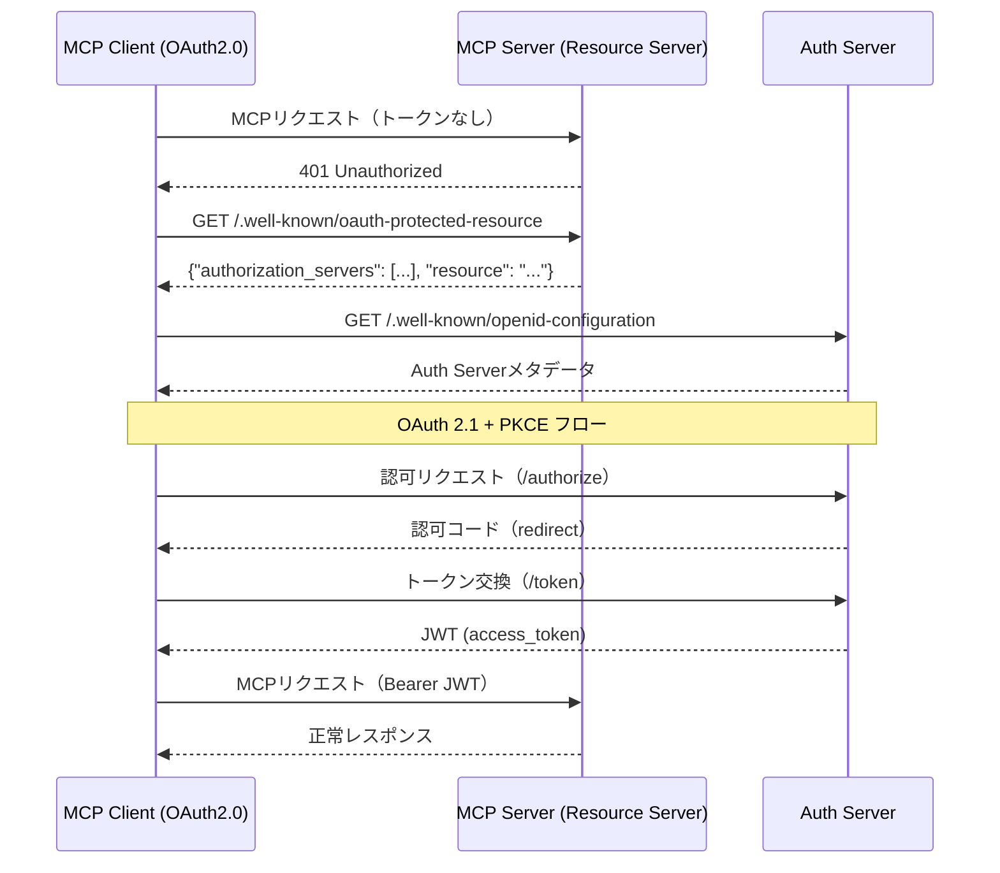

# AUS - CLO インタラクション詳細（dtl-itr-AUS-CLO）

## ドキュメント管理情報

| 項目 | 値 |
|------|-----|
| Status | `draft` |
| Version | v1.0 |
| ID | ITR-REL-002 |
| Note | Auth Server - MCP Client (OAuth2.0) Interaction Detail |

---

## 概要

| 項目 | 内容 |
|------|------|
| 連携元 | MCP Client (OAuth2.0) (CLO) |
| 連携先 | Auth Server (AUS) |
| 内容 | OAuth認可 |
| プロトコル | OAuth 2.1 / HTTPS |

---

## 詳細

| 項目 | 内容 |
|------|------|
| プロトコル | HTTPS |
| 認証方式 | OAuth 2.1 + PKCE |
| 参照仕様 | [OAuth 2.1](https://datatracker.ietf.org/doc/html/draft-ietf-oauth-v2-1-12), [RFC 7636 (PKCE)](https://datatracker.ietf.org/doc/html/rfc7636), [RFC 8707 (Resource Indicators)](https://datatracker.ietf.org/doc/html/rfc8707) |

### 初回認可フロー



### OAuth 2.1 + PKCEフロー詳細

**1. 認可リクエスト:**
```
GET /authorize
  ?response_type=code
  &client_id={client_id}
  &redirect_uri={redirect_uri}
  &scope=openid profile
  &code_challenge={code_challenge}
  &code_challenge_method=S256
  &state={state}
  &resource=https://mcp.mcpist.app
```

**2. 認可コード返却:**
```
{redirect_uri}?code={code}&state={state}
```

**3. トークン交換:**
```
POST /token
  grant_type=authorization_code
  &code={code}
  &redirect_uri={redirect_uri}
  &client_id={client_id}
  &code_verifier={code_verifier}
  &resource=https://mcp.mcpist.app
```

**4. トークンレスポンス:**
```json
{
  "access_token": "eyJ...",
  "token_type": "Bearer",
  "expires_in": 3600,
  "refresh_token": "..."
}
```

---

## 関連ドキュメント

| ドキュメント | 内容 |
|-------------|------|
| [itr-clo.md](./itr-clo.md) | MCP Client (OAuth2.0) 詳細仕様 |
| [itr-aus.md](./itr-aus.md) | Auth Server 詳細仕様 |
| [idx-itr-rel.md](./idx-itr-rel.md) | インタラクション関係ID一覧 |
