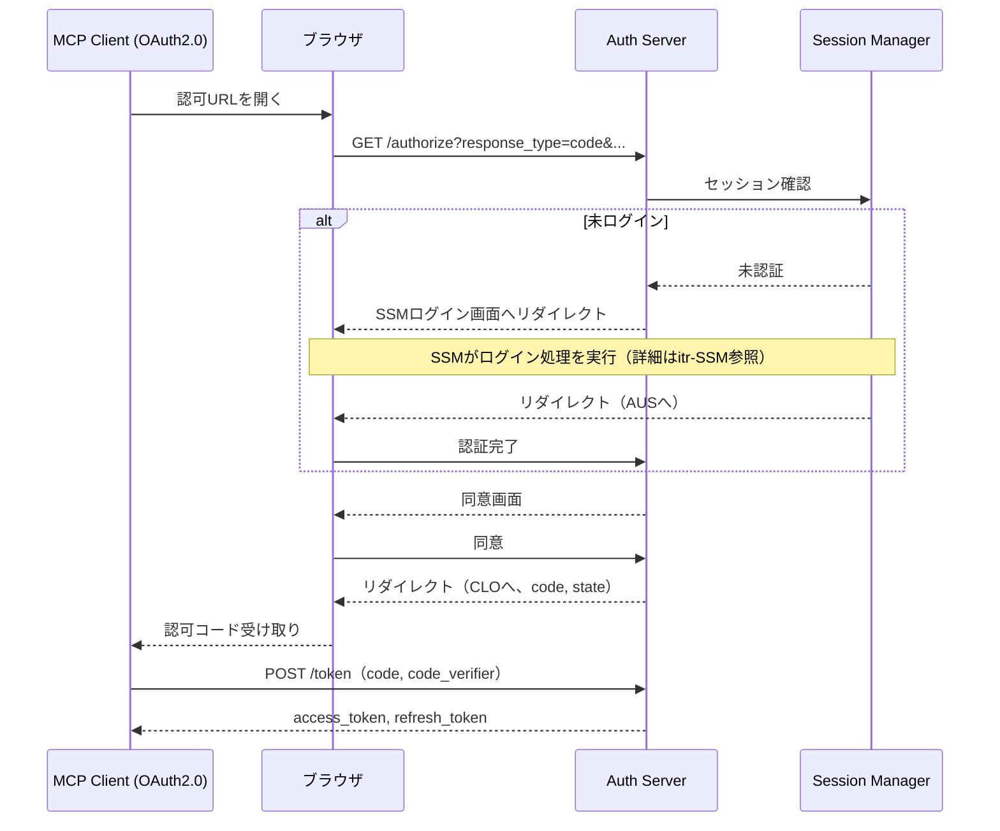

# AUS - SSM インタラクション詳細（dtl-itr-AUS-SSM）

## ドキュメント管理情報

| 項目 | 値 |
|------|-----|
| Status | `draft` |
| Version | v1.0 |
| ID | ITR-REL-020 |
| Note | Auth Server - Session Manager Interaction Detail |

---

## 概要

| 項目 | 内容 |
|------|------|
| 連携元 | Session Manager (SSM) |
| 連携先 | Auth Server (AUS) |
| 内容 | ユーザー認証連携 |
| プロトコル | Supabase Auth内部処理 |

---

## 詳細

| 項目 | 内容 |
|------|------|
| 方向 | AUS ↔ SSM |
| 用途 | OAuth 2.1認可フローにおけるユーザー認証 |
| トリガー | /authorize リクエスト時 |
| 実装 | Supabase Auth内部処理（実装範囲外） |

AUSは認可リクエスト時にSSMと連携し、ユーザーのログイン状態を確認する。

### フロー

### 認証フロー詳細

1. AUSが/authorizeリクエストを受信
2. SSMにセッション確認を依頼
3. 未ログインの場合、SSMのログインフローにリダイレクト
4. ログイン完了後、SSMがAUSにユーザー情報を返却
5. AUSが同意画面を表示し、認可コードを発行

ログイン処理の詳細（認証方式、IDP連携等）は [itr-SSM.md](./itr-SSM.md) を参照。

### SSMから取得する情報

- user_id（Supabase Auth UUID）
- email
- display_name

---

## 関連ドキュメント

| ドキュメント | 内容 |
|-------------|------|
| [itr-SSM.md](./itr-SSM.md) | Session Manager 詳細仕様 |
| [itr-AUS.md](./itr-AUS.md) | Auth Server 詳細仕様 |
| [idx-itr-rel.md](./idx-itr-rel.md) | インタラクション関係ID一覧 |
