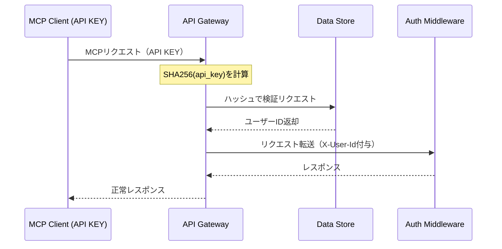

# CLK - GWY インタラクション詳細（dtl-itr-CLK-GWY）

## ドキュメント管理情報

| 項目      | 値                                                     |
| ------- | ----------------------------------------------------- |
| Status  | `reviewed`                                            |
| Version | v2.0                                                  |
| Note    | MCP Client (API KEY) - API Gateway Interaction Detail |

---

## 概要

| 項目 | 内容 |
|------|------|
| 連携元 | MCP Client (API KEY) (CLK) |
| 連携先 | API Gateway (GWY) |
| 内容 | MCP通信 |
| プロトコル | Streamable HTTP |

---

## 詳細

| 項目 | 内容 |
|------|------|
| プロトコル | [MCP Protocol 2025-11-25](https://modelcontextprotocol.io/specification/2025-11-25)（JSON-RPC 2.0 over Streamable HTTP） |
| 認証方式 | API KEY（Bearer Token形式） |
| エンドポイント | - `https://mcp.mcpist.app/mcp` (本番環境)<br>- `https://mcp.stg.mcpist.app/mcp` (ステージング環境)<br>- `https://mcp.dev.mcpist.app/mcp` (開発環境) |

### API KEY形式

```
mpt_{random_string_32chars}
```

### リクエストヘッダー（MCP仕様準拠）

[Transports](https://modelcontextprotocol.io/specification/2025-11-25/basic/transports):
```
Accept: application/json, text/event-stream
MCP-Protocol-Version: 2025-11-25
MCP-Session-Id: {session_id}
```

[Authorization](https://modelcontextprotocol.io/specification/2025-11-25/basic/authorization):
```
Authorization: Bearer mpt_xxx
```

HTTP標準:
```
Content-Type: application/json
```

CLKはMCPプリミティブ（Tools, Resources, Prompts）をJSON-RPCリクエストとして送信する。詳細は [spc-itf.md](../spc-itf.md) を参照。

### 認証フロー



### API KEY検証

| 優先度 | ステップ | 説明 |
|--------|----------|------|
| 1 | ハッシュ計算 | GWY が API KEY の SHA256 ハッシュを計算（平文は即破棄） |
| 2 | DST 検証 | GWY が DST にハッシュで検証を依頼（`lookup_user_by_key_hash` RPC） |
| 3 | ユーザーID特定 | DST がハッシュからユーザーIDを返却 |
| 4 | リクエスト転送 | 検証成功時、GWY が X-User-Id ヘッダーを付与して AMW へ転送 |

### 認証失敗時のレスポンス

検証が失敗した場合、GWY は以下を返却する。

| 項目 | 値 |
|------|------|
| ステータス | 401 Unauthorized |
| ボディ | `{"error": "Unauthorized"}` |

### 期待する振る舞い

- CLK は API KEY を Bearer Token 形式で Authorization ヘッダーに付与してリクエストを送信する
- GWY は API KEY の SHA256 ハッシュを計算し、平文は即座に破棄する
- GWY は DST の `lookup_user_by_key_hash` RPC にハッシュを送信して検証を依頼する
- DST はハッシュに対応するユーザーIDを返却する（該当なしの場合は null）
- 検証成功時、GWY は X-User-Id, X-Auth-Type, X-Request-Id, X-Gateway-Secret ヘッダーを付与して AMW へ転送する
- GWY は KV キャッシュを使用してパフォーマンスを最適化する（TTL: 24時間、soft-max-age: 1時間）
- MCP ヘッダー（MCP-Protocol-Version, MCP-Session-Id 等）は GWY がパススルーする

### API KEY取得方法

API KEYはUser Console（CON）で発行する。ユーザーは発行されたAPI KEYをCLKの設定（環境変数やconfig等）に設定し、リクエスト時にAuthorizationヘッダーに付与する。

**注意事項:**
- API KEYは発行時に一度だけ表示される（再表示不可）
- 紛失した場合は再発行が必要
- 発行フローの詳細は [itr-CON.md](./itr-CON.md) を参照

---

## 関連ドキュメント

| ドキュメント | 内容 |
|-------------|------|
| [itr-CLK.md](./itr-CLK.md) | MCP Client (API KEY) 詳細仕様 |
| [itr-GWY.md](./itr-GWY.md) | API Gateway 詳細仕様 |
| [itr-DST.md](./itr-DST.md) | Data Store 詳細仕様 |
| [dtl-itr-AMW-GWY.md](./dtl-itr-AMW-GWY.md) | GWY→AMW 転送ヘッダー詳細 |
