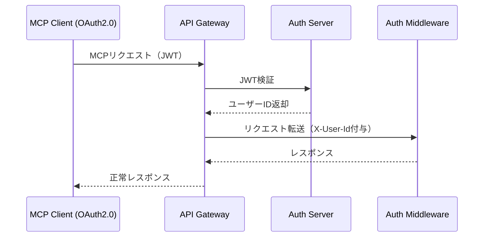

# CLO - GWY インタラクション詳細（dtl-itr-CLO-GWY）

## ドキュメント管理情報

| 項目      | 値                                                      |
| ------- | ------------------------------------------------------ |
| Status  | `reviewed`                                             |
| Version | v2.0                                                   |
| Note    | MCP Client (OAuth2.0) - API Gateway Interaction Detail |

---

## 概要

| 項目 | 内容 |
|------|------|
| 連携元 | MCP Client (OAuth2.0) (CLO) |
| 連携先 | API Gateway (GWY) |
| 内容 | MCP通信 |
| プロトコル | Streamable HTTP |

---

## 詳細

| 項目 | 内容 |
|------|------|
| プロトコル | [MCP Protocol 2025-11-25](https://modelcontextprotocol.io/specification/2025-11-25)（JSON-RPC 2.0 over Streamable HTTP） |
| 認証方式 | Bearer Token（JWT） |
| エンドポイント | - `https://mcp.mcpist.app/mcp` (本番環境)<br>- `https://mcp.stg.mcpist.app/mcp` (ステージング環境)<br>- `https://mcp.dev.mcpist.app/mcp` (開発環境) |

### リクエストヘッダー（MCP仕様準拠）

[Transports](https://modelcontextprotocol.io/specification/2025-11-25/basic/transports):
```
Accept: application/json, text/event-stream
MCP-Protocol-Version: 2025-11-25
MCP-Session-Id: {session_id}
```

[Authorization](https://modelcontextprotocol.io/specification/2025-11-25/basic/authorization):
```
Authorization: Bearer {access_token}
```

HTTP標準:
```
Content-Type: application/json
```

CLOはMCPプリミティブ（Tools, Resources, Prompts）をJSON-RPCリクエストとして送信する。詳細は [spc-itf.md](../spc-itf.md) を参照。

### 認証フロー



### JWT検証

GWY は以下の優先順で JWT を検証し、いずれかが成功した時点でユーザーIDを確定する。

| 優先度 | 方式             | エンドポイント                        | 説明                                                          |
| --- | -------------- | ------------------------------ | ----------------------------------------------------------- |
| 1   | OAuth userinfo | /auth/v1/oauth/userinfo        | Bearer トークンを送信し、`sub` クレームからユーザーIDを取得                       |
| 2   | Auth user      | /auth/v1/user                  | Bearer トークン + API キーを送信し、`id` フィールドからユーザーIDを取得              |
| 3   | JWKS 署名検証      | /auth/v1/.well-known/jwks.json | JWKS から公開鍵を取得し、JWT 署名を検証。`issuer` クレームを検証。`sub` からユーザーIDを取得 |

### 認証失敗時のレスポンス

すべての検証方式が失敗した場合、GWY は以下を返却する。

| 項目 | 値 |
|------|------|
| ステータス | 401 Unauthorized |
| ヘッダー | `WWW-Authenticate: Bearer resource_metadata="{base_url}/mcp/.well-known/oauth-protected-resource"` |
| ボディ | `{"error": "Unauthorized"}` |

### 期待する振る舞い

- CLO は OAuth2.0 認可フローで取得した JWT を Bearer Token 形式で Authorization ヘッダーに付与してリクエストを送信する
- GWY は優先度1から順に検証を試行し、いずれかが成功した時点でユーザーIDを確定する
- 優先度1・2は AUS がトークンの有効性を判定するため、GWY 側でのクレーム検証は不要
- 優先度3（JWKS）では `issuer` クレームを検証する。JWKS はライブラリのキャッシュ機構に従う
- 検証成功時、GWY は X-User-Id, X-Auth-Type, X-Request-Id, X-Gateway-Secret ヘッダーを付与して AMW へ転送する
- すべての検証が失敗した場合、401 + `WWW-Authenticate` ヘッダーで OAuth Discovery フローを案内する
- MCP ヘッダー（MCP-Protocol-Version, MCP-Session-Id 等）は GWY がパススルーする

---

## 関連ドキュメント

| ドキュメント | 内容 |
|-------------|------|
| [itr-CLO.md](./itr-CLO.md) | MCP Client (OAuth2.0) 詳細仕様 |
| [itr-GWY.md](./itr-GWY.md) | API Gateway 詳細仕様 |
| [itr-AUS.md](./itr-AUS.md) | Auth Server 詳細仕様 |
| [dtl-itr-AUS-GWY.md](./dtl-itr-AUS-GWY.md) | GWY→AUS JWT検証詳細 |
| [dtl-itr-AMW-GWY.md](./dtl-itr-AMW-GWY.md) | GWY→AMW 転送ヘッダー詳細 |
