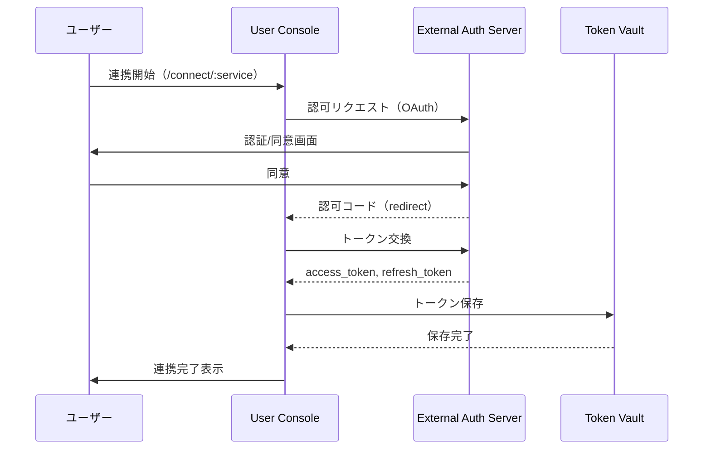

# CON - EAS インタラクション詳細（dtl-itr-CON-EAS）

## ドキュメント管理情報

| 項目      | 値                                                      |
| ------- | ------------------------------------------------------ |
| Status  | `reviewed`                                             |
| Version | v2.0                                                   |
| Note    | User Console - External Auth Server Interaction Detail |

---

## 概要

| 項目 | 内容 |
|------|------|
| 連携元 | User Console (CON) |
| 連携先 | External Auth Server (EAS) |
| 内容 | 認可フロー |
| プロトコル | OAuth 2.0 / HTTPS |

---

## 詳細

| 項目 | 内容 |
|------|------|
| プロトコル | OAuth 2.0 |
| 用途 | 外部サービスへのアクセス権限取得 |

### フロー

### 主な対応サービス

- Notion
- Google Calendar
- Microsoft To Do

---

## 関連ドキュメント

| ドキュメント                             | 内容                        |
| ---------------------------------- | ------------------------- |
| [itr-CON.md](./itr-CON.md)         | User Console 詳細仕様         |
| [itr-EAS.md](./itr-EAS.md)         | External Auth Server 詳細仕様 |

