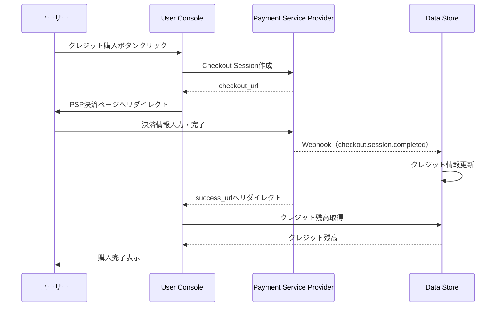

# CON - PSP インタラクション詳細（dtl-itr-CON-PSP）

## ドキュメント管理情報

| 項目 | 値 |
|------|-----|
| Status | `draft` |
| Version | v1.0 |
| ID | ITR-REL-017 |
| Note | User Console - Payment Service Provider Interaction Detail |

---

## 概要

| 項目 | 内容 |
|------|------|
| 連携元 | User Console (CON) |
| 連携先 | Payment Service Provider (PSP) |
| 内容 | 決済 |
| プロトコル | HTTPS |

---

## 詳細

| 項目 | 内容 |
|------|------|
| プロトコル | HTTPS |
| 用途 | クレジット購入、課金管理 |

### フロー

---

## 関連ドキュメント

| ドキュメント | 内容 |
|-------------|------|
| [itr-CON.md](./itr-CON.md) | User Console 詳細仕様 |
| [itr-PSP.md](./itr-PSP.md) | Payment Service Provider 詳細仕様 |
| [idx-itr-rel.md](./idx-itr-rel.md) | インタラクション関係ID一覧 |
