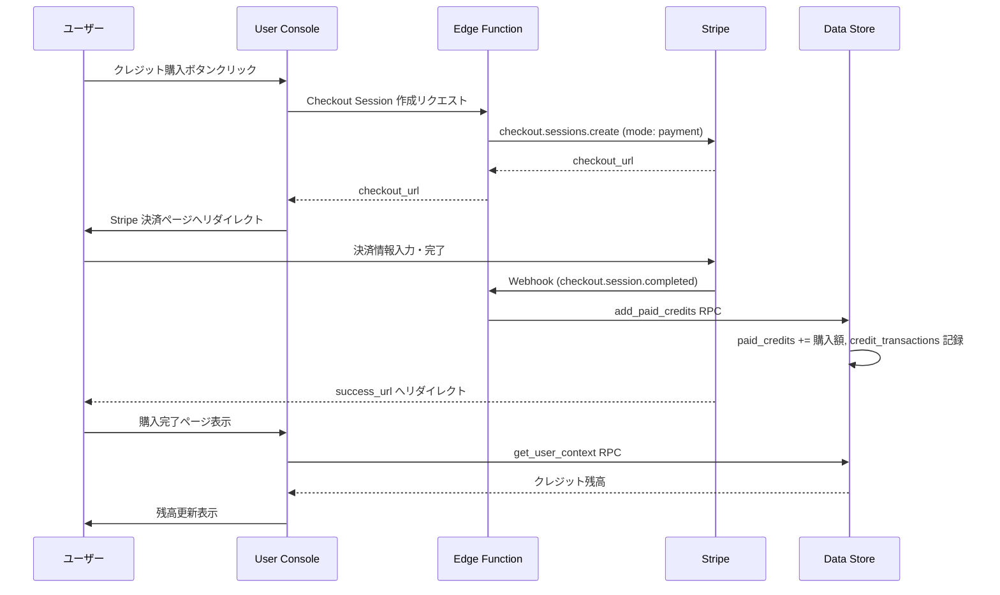

# CON - PSP インタラクション詳細（dtl-itr-CON-PSP）

## ドキュメント管理情報

| 項目      | 値                                                          |
| ------- | ---------------------------------------------------------- |
| Status  | `reviewed`                                                 |
| Version | v2.2                                                       |
| Note    | User Console - Payment Service Provider Interaction Detail |

---

## 概要

| 項目 | 内容 |
|------|------|
| 連携元 | User Console (CON) |
| 連携先 | Payment Service Provider (PSP) |
| 内容 | クレジット購入（前払い制） |
| プロトコル | HTTPS |

---

## 詳細

| 項目 | 内容 |
|------|------|
| PSP | Stripe |
| 決済方式 | Stripe Checkout（ホスト型決済画面） |
| 課金モデル | クレジット前払い制（プリペイド） |

---

## クレジット購入

### クレジットパック（案）

| 商品名 | クレジット数 | 価格 | 備考 |
|--------|-------------|------|------|
| Credit Pack S | 1,000 | ¥1,000 | 基本パック |
| Credit Pack M | 5,000 | ¥4,500 | 10%割引 |
| Credit Pack L | 10,000 | ¥8,000 | 20%割引 |

### 購入フロー



### Webhook 処理

| イベント | 処理 |
|----------|------|
| `checkout.session.completed` | `add_paid_credits` RPC でクレジット加算 |

### 冪等性保証

| 項目 | 内容 |
|------|------|
| 識別子 | Stripe Checkout Session ID |
| 記録先 | credit_transactions テーブル（stripe_session_id カラム） |
| 重複防止 | UNIQUE 制約により同一 session_id の重複処理を防止 |

---

## 残高通知

### 通知条件

| 条件 | 閾値 | 通知方法 |
|------|------|----------|
| 残高低下 | 合計残高（free + paid）が 100 以下 | ダッシュボード通知 + メール |
| 残高枯渇 | 合計残高が 0 | ダッシュボード通知 + メール |

### 通知タイミング

- **ダッシュボード通知**: CON ログイン時にバナー表示
- **メール通知**: クレジット消費時に閾値を下回った場合に送信（1日1回上限）

### 通知内容

**残高低下時:**
```
クレジット残高が少なくなっています。
現在の残高: XX クレジット
サービスを継続してご利用いただくため、クレジットの購入をご検討ください。
```

**残高枯渇時:**
```
クレジット残高がなくなりました。
ツールの実行にはクレジットが必要です。
クレジットを購入してください。
```

---

## 期待する振る舞い

### 購入

- ユーザーが CON の購入ボタンをクリックすると、Edge Function が Stripe Checkout Session を作成する
- Checkout Session は `mode: payment`（一回払い）で作成される
- ユーザーは Stripe のホスト型決済画面で決済を完了する
- 決済完了後、Stripe が Webhook で `checkout.session.completed` を送信する
- Edge Function は Webhook 署名を検証し、`add_paid_credits` RPC を呼び出す
- `add_paid_credits` は paid_credits に購入額を加算し、credit_transactions に取引履歴を記録する
- 同一 session_id の重複処理は credit_transactions の UNIQUE 制約で防止される
- ユーザーは success_url にリダイレクトされ、CON が最新のクレジット残高を表示する

### 残高通知

- クレジット消費後、合計残高が閾値（100）以下になった場合、通知フラグを立てる
- CON ログイン時に通知フラグを確認し、バナーを表示する
- メール通知は1日1回を上限とし、過剰な通知を防止する
- クレジット購入後、通知フラグをリセットする

---

## 将来拡張: サブスクリプション

Phase 2 以降でサブスクリプション方式の導入を検討する。

### サブスクリプションプラン（案）

| プラン名 | 月額クレジット付与 | 価格 | 備考 |
|----------|------------------|------|------|
| Basic | 1,000 | ¥500/月 | ライトユーザー向け |
| Plus | 5,000 | ¥2,000/月 | 標準ユーザー向け |
| Pro | 15,000 | ¥5,000/月 | ヘビーユーザー向け |

---

## 関連ドキュメント

| ドキュメント | 内容 |
|-------------|------|
| [itr-CON.md](./itr-CON.md) | User Console 詳細仕様 |
| [itr-PSP.md](./itr-PSP.md) | Payment Service Provider 詳細仕様 |
| [dtl-itr-DST-PSP.md](./dtl-itr-DST-PSP.md) | DST→PSP Webhook 処理詳細 |
| [dtl-spc-credit-model.md](dtl-spc-credit-model.md) | クレジットモデル詳細仕様 |
