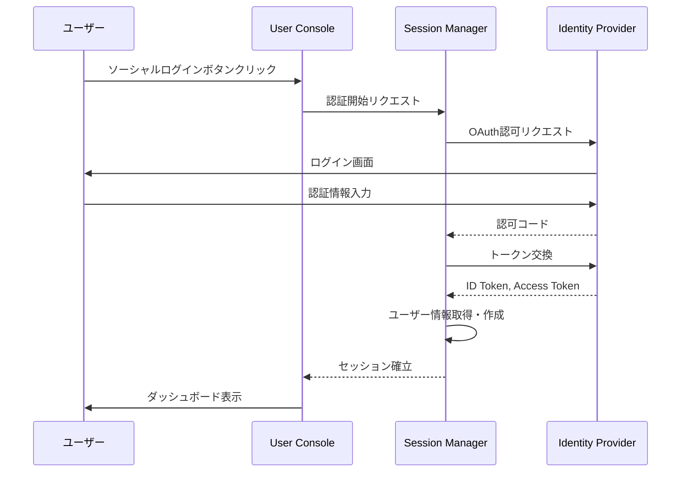

# CON - SSM インタラクション詳細（dtl-itr-CON-SSM）

## ドキュメント管理情報

| 項目 | 値 |
|------|-----|
| Status | `draft` |
| Version | v1.0 |
| ID | ITR-REL-014 |
| Note | User Console - Session Manager Interaction Detail |

---

## 概要

| 項目 | 内容 |
|------|------|
| 連携元 | User Console (CON) |
| 連携先 | Session Manager (SSM) |
| 内容 | ソーシャルログイン |
| プロトコル | OAuth 2.0 / OpenID Connect |

---

## 詳細

| 項目 | 内容 |
|------|------|
| プロトコル | OAuth 2.0 / OpenID Connect（SSM経由） |
| 用途 | ユーザーログイン |

CONはSSMを経由してIDPと通信する。CONとIDPの直接通信はない。

### フロー

### 対応プロバイダ

- Google
- Apple
- Microsoft
- GitHub

---

## 関連ドキュメント

| ドキュメント | 内容 |
|-------------|------|
| [itr-CON.md](./itr-CON.md) | User Console 詳細仕様 |
| [itr-SSM.md](./itr-SSM.md) | Session Manager 詳細仕様 |
| [idx-itr-rel.md](./idx-itr-rel.md) | インタラクション関係ID一覧 |
