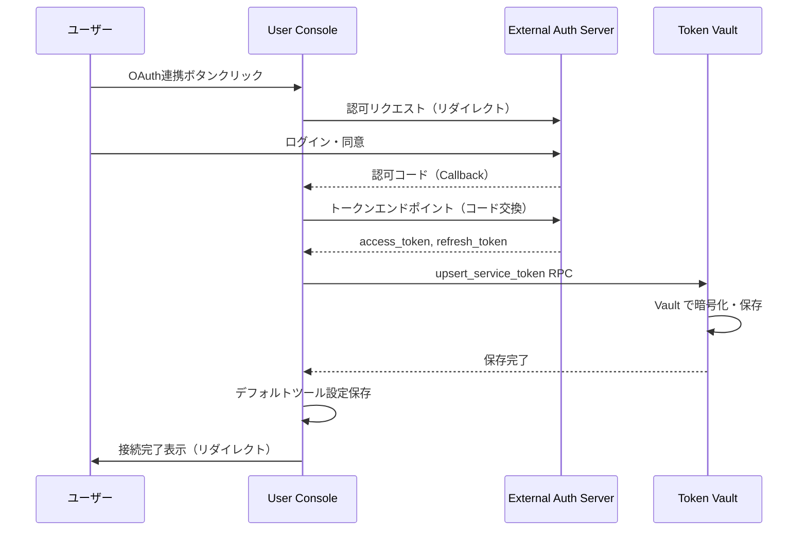

# CON - TVL インタラクション詳細（dtl-itr-CON-TVL）

## ドキュメント管理情報

| 項目      | 値                                               |
| ------- | ----------------------------------------------- |
| Status  | `reviewed`                                      |
| Version | v2.0                                            |
| Note    | User Console - Token Vault Interaction Detail   |

---

## 概要

| 項目 | 内容 |
|------|------|
| 連携元 | User Console (CON) |
| 連携先 | Token Vault (TVL) |
| 内容 | 外部サービストークン登録・管理 |
| プロトコル | Supabase RPC |

---

## 詳細

| 項目 | 内容 |
|------|------|
| 方向 | CON → TVL（単方向） |
| 用途 | 外部サービスのトークン保存・削除・一覧取得 |

### 対応サービス

| サービス | 認証方式 | 備考 |
|----------|----------|------|
| Notion | API Key (Bearer) | 内部インテグレーショントークン |
| GitHub | API Key (Bearer) | Personal Access Token |
| Jira | Basic Auth | メールアドレス + APIトークン |
| Confluence | Basic Auth | メールアドレス + APIトークン |
| Supabase | API Key (Bearer) | Management API トークン |
| Google Calendar | OAuth2 | OAuth連携 |
| Microsoft To Do | OAuth2 | OAuth連携 |

---

## トークン登録

### 登録フロー（手動入力）


### 登録フロー（OAuth連携）



### RPC: upsert_service_token

| パラメータ | 型 | 説明 |
|-----------|-----|------|
| p_service | TEXT | サービス識別子（notion, github, jira 等） |
| p_credentials | JSONB | 認証情報（auth_type により構造が異なる） |

**credentials 構造（API Key / Bearer）:**
```json
{
  "_auth_type": "api_key",
  "access_token": "secret_xxx"
}
```

**credentials 構造（Basic Auth）:**
```json
{
  "_auth_type": "basic",
  "username": "user@example.com",
  "access_token": "api_token_xxx",
  "domain": "example.atlassian.net"
}
```

**credentials 構造（OAuth2）:**
```json
{
  "_auth_type": "oauth2",
  "access_token": "ya29.xxx",
  "refresh_token": "1//xxx",
  "token_type": "Bearer",
  "scope": "https://www.googleapis.com/auth/calendar",
  "expires_at": 1234567890
}
```

### トークン検証

トークン保存前に外部サービスAPIで疎通確認を行う。

| サービス | 検証エンドポイント | 認証方式 |
|----------|-------------------|----------|
| Notion | `/v1/users/me` | Bearer |
| GitHub | `/user` | Bearer |
| Supabase | `/v1/projects` | Bearer |
| Jira | `/rest/api/3/myself` | Basic |
| Confluence | `/wiki/rest/api/user/current` | Basic |

### 暗号化

| 項目 | 内容 |
|------|------|
| 暗号化方式 | Supabase Vault |
| 保存先 | vault.secrets テーブル |
| service_tokens | credentials_secret_id（参照のみ保存） |

---

## トークン削除

### RPC: delete_service_token

| パラメータ | 型 | 説明 |
|-----------|-----|------|
| p_service | TEXT | サービス識別子 |

- service_tokens レコードと vault.secrets を削除
- 対応する tool_settings も削除

---

## 接続一覧取得

### RPC: list_service_connections

| 戻り値 | 型 | 説明 |
|--------|-----|------|
| service | TEXT | サービス識別子 |
| connected_at | TIMESTAMPTZ | 接続日時 |

- credentials の中身は返却しない（セキュリティ）

---

## 期待する振る舞い

### トークン登録

- ユーザーが CON でトークンを入力すると、まず外部サービスAPIで検証を行う
- 検証成功後、`upsert_service_token` RPC で TVL に保存する
- TVL は Supabase Vault を使用して credentials を暗号化する
- service_tokens テーブルには credentials_secret_id のみ保存される（平文は保存しない）
- 既存トークンがある場合は上書きされる（UNIQUE 制約）
- トークン保存後、`saveDefaultToolSettings` でデフォルトツール設定を自動作成する
- OAuth連携の場合、Callback で認可コードをトークンに交換し、同様に TVL に保存する

### トークン削除

- ユーザーが CON で切断ボタンをクリックすると、`delete_service_token` RPC を呼び出す
- service_tokens レコードと vault.secrets が削除される
- 対応する tool_settings も削除される

### 接続一覧

- CON は `list_service_connections` RPC で接続済みサービス一覧を取得する
- credentials の中身は返却されない（サービス名と接続日時のみ）

---

## 関連ドキュメント

| ドキュメント | 内容 |
|-------------|------|
| [itr-CON.md](./itr-CON.md) | User Console 詳細仕様 |
| [itr-TVL.md](./itr-TVL.md) | Token Vault 詳細仕様 |
| [dtl-itr-MOD-TVL.md](./dtl-itr-MOD-TVL.md) | MOD→TVL トークン取得・リフレッシュ |
| [dtl-itr-CON-EAS.md](./dtl-itr-CON-EAS.md) | CON→EAS OAuth連携 |
