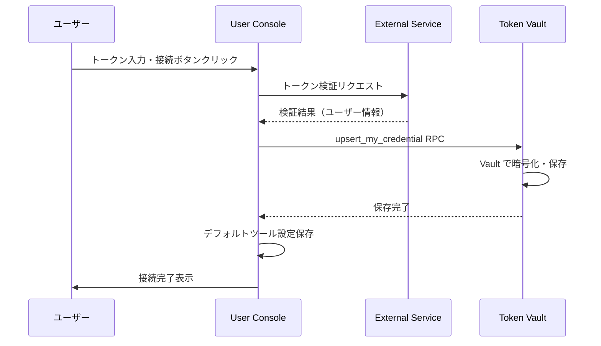

# CON - TVL インタラクション詳細（dtl-itr-CON-TVL）

## ドキュメント管理情報

| 項目      | 値                                               |
| ------- | ----------------------------------------------- |
| Status  | `reviewed`                                      |
| Version | v2.2                                            |
| Note    | User Console - Token Vault Interaction Detail   |

---

## 概要

| 項目 | 内容 |
|------|------|
| 連携元 | User Console (CON) |
| 連携先 | Token Vault (TVL) |
| 内容 | 外部サービストークン登録・管理 |
| プロトコル | Supabase RPC |

---

## 詳細

| 項目 | 内容 |
|------|------|
| 方向 | CON → TVL（単方向） |
| 用途 | 外部サービスのトークン保存・削除・一覧取得 |

### 対応モジュール

対応モジュールと認証方式の詳細は [dtl-itr-MOD-TVL.md](./dtl-itr-MOD-TVL.md) の「モジュール別auth_type」を参照。

| モジュール | auth_type | 認可方式 | 備考 |
|-----------|-----------|---------|------|
| notion | `oauth2` | OAuth 2.0 | OAuth連携 |
| github | `oauth2` / `api_key` | OAuth 2.0 / PAT | OAuth App または Personal Access Token |
| jira | `basic` | API Token | メールアドレス + APIトークン |
| confluence | `basic` | API Token | メールアドレス + APIトークン |
| supabase | `api_key` | PAT | Management API トークン |
| google_calendar | `oauth2` | OAuth 2.0 | OAuth連携 |
| microsoft_todo | `oauth2` | OAuth 2.0 | OAuth連携 |
| trello | `api_key` | OAuth 1.0a | クエリパラメータ方式 |
| grafana | `api_key` | Service Account | Service Account Token |
| postgresql | `basic` | 直接接続 | ユーザー名 + パスワード |

---

## トークン登録

### 登録フロー（手動入力）



### 登録フロー（OAuth連携）


### RPC: upsert_my_credential

| パラメータ | 型 | 説明 |
|-----------|-----|------|
| p_module | TEXT | モジュール識別子（notion, github, jira 等） |
| p_credentials | JSONB | 認証情報（auth_type + credentials） |

credentials 構造の詳細は [dtl-itr-MOD-TVL.md](./dtl-itr-MOD-TVL.md) を参照。

**credentials 構造（API Key / Bearer）:**
```json
{
  "auth_type": "api_key",
  "access_token": "secret_xxx"
}
```

**credentials 構造（Basic Auth）:**
```json
{
  "auth_type": "basic",
  "username": "user@example.com",
  "password": "api_token_xxx",
  "metadata": {
    "domain": "example.atlassian.net"
  }
}
```

**credentials 構造（OAuth2）:**
```json
{
  "auth_type": "oauth2",
  "access_token": "ya29.xxx",
  "refresh_token": "1//xxx",
  "expires_at": 1234567890,
  "metadata": {
    "workspace_id": "xxx",
    "workspace_name": "My Workspace"
  }
}
```

**credentials 構造（API Key + クエリパラメータ - Trello）:**
```json
{
  "auth_type": "api_key",
  "access_token": "xxx",
  "api_key": "xxx"
}
```

### トークン検証

トークン保存前に外部APIで疎通確認を行う。

| モジュール | 検証エンドポイント | auth_type |
|----------|-------------------|----------|
| notion | `/v1/users/me` | `oauth2` / `api_key` |
| github | `/user` | `oauth2` / `api_key` |
| supabase | `/v1/projects` | `api_key` |
| jira | `/rest/api/3/myself` | `basic` |
| confluence | `/wiki/rest/api/user/current` | `basic` |
| trello | `/1/members/me` | `api_key` |
| grafana | `/api/user` | `api_key` |

### 暗号化

| 項目 | 内容 |
|------|------|
| 暗号化方式 | Supabase Vault |
| 保存先 | vault.secrets テーブル |
| credentials テーブル | credentials_secret_id（参照のみ保存） |

---

## トークン削除

### RPC: delete_my_credential

| パラメータ | 型 | 説明 |
|-----------|-----|------|
| p_module | TEXT | モジュール識別子 |

- credentials レコードと vault.secrets を削除
- 対応する tool_settings も削除

---

## 接続一覧取得

### RPC: list_my_credentials

| 戻り値 | 型 | 説明 |
|--------|-----|------|
| module | TEXT | モジュール識別子 |
| created_at | TIMESTAMPTZ | 作成日時 |
| updated_at | TIMESTAMPTZ | 更新日時 |

- credentials の中身は返却しない（セキュリティ）

---

## 期待する振る舞い

### トークン登録

- ユーザーが CON でトークンを入力すると、まず外部APIで検証を行う
- 検証成功後、`upsert_my_credential` RPC で TVL に保存する
- TVL は Supabase Vault を使用して credentials を暗号化する
- credentials テーブルには credentials_secret_id のみ保存される（平文は保存しない）
- 既存トークンがある場合は上書きされる（UNIQUE 制約）
- トークン保存後、`saveDefaultToolSettings` でデフォルトツール設定を自動作成する
- OAuth連携の場合、Callback で認可コードをトークンに交換し、同様に TVL に保存する

### トークン削除

- ユーザーが CON で切断ボタンをクリックすると、`delete_my_credential` RPC を呼び出す
- credentials レコードと vault.secrets が削除される
- 対応する tool_settings も削除される

### 接続一覧

- CON は `list_my_credentials` RPC で接続済みモジュール一覧を取得する
- credentials の中身は返却されない（モジュール名と日時のみ）

---

## 関連ドキュメント

| ドキュメント | 内容 |
|-------------|------|
| [itr-CON.md](./itr-CON.md) | User Console 詳細仕様 |
| [itr-TVL.md](./itr-TVL.md) | Token Vault 詳細仕様 |
| [dtl-itr-MOD-TVL.md](./dtl-itr-MOD-TVL.md) | MOD→TVL トークン取得・リフレッシュ |
| [dtl-itr-CON-EAS.md](./dtl-itr-CON-EAS.md) | CON→EAS OAuth連携 |
