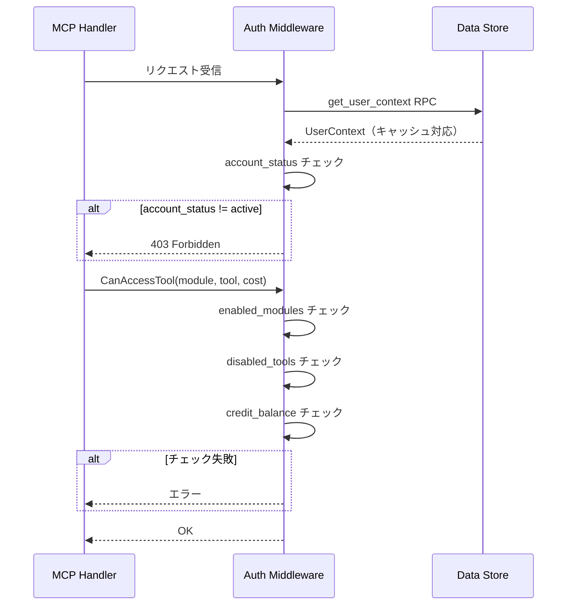

# DST - HDL インタラクション詳細（dtl-itr-DST-HDL）

## ドキュメント管理情報

| 項目      | 値                                           |
| ------- | ------------------------------------------- |
| Status  | `reviewed`                                  |
| Version | v2.0                                        |
| Note    | Data Store - MCP Handler Interaction Detail |

---

## 概要

| 項目 | 内容 |
|------|------|
| 連携元 | MCP Handler (HDL) |
| 連携先 | Data Store (DST) |
| 内容 | ユーザーコンテキスト取得、クレジット消費 |
| プロトコル | Supabase RPC |

---

## 詳細

| 項目 | 内容 |
|------|------|
| 方向 | HDL → DST（単方向） |
| トリガー | MCPメソッドリクエスト時 |
| 操作 | ユーザー設定・状態の取得、クレジット消費 |

---

## ユーザーコンテキスト取得

### RPC: get_user_context

| パラメータ | 型 | 説明 |
|-----------|-----|------|
| p_user_id | UUID | ユーザーID |

### 取得する情報

| フィールド | 型 | 説明 |
|-----------|-----|------|
| account_status | string | アカウント状態（active/suspended/disabled） |
| free_credits | integer | 無料クレジット残高 |
| paid_credits | integer | 有料クレジット残高 |
| enabled_modules | string[] | 有効なモジュール一覧 |
| disabled_tools | map[string]string[] | モジュール別の無効ツール一覧 |

**注:** プランによるモジュール制限は行わない。

### キャッシュ

| 項目 | 内容 |
|------|------|
| TTL | 30秒 |
| 無効化タイミング | クレジット消費後 |

---

## 権限チェック

### チェックフロー

### チェック項目

| チェック | タイミング | エラー条件 | エラーコード |
|----------|------------|-----------|--------------|
| account_status | authorization時 | active 以外 | ACCOUNT_NOT_ACTIVE |
| enabled_modules | ツール実行時 | モジュールが有効リストにない | MODULE_NOT_ENABLED |
| disabled_tools | ツール実行時 | ツールが無効リストにある | TOOL_DISABLED |
| credit_balance | ツール実行時 | free + paid < cost | INSUFFICIENT_CREDITS |

### モジュール隠蔽

- `get_module_schema` 呼び出し時、disabled_tools により有効ツールが0件のモジュールは非表示
- クライアントには "Unknown module" として報告される

---

## クレジット消費

### RPC: consume_credit

| パラメータ | 型 | 説明 |
|-----------|-----|------|
| p_user_id | UUID | ユーザーID |
| p_module | TEXT | モジュール名 |
| p_tool | TEXT | ツール名 |
| p_amount | INTEGER | 消費クレジット数 |
| p_request_id | TEXT | リクエストID（冪等性保証） |

### 消費順序

1. free_credits を先に消費
2. free_credits が 0 になったら paid_credits を消費

### 冪等性保証

| 項目 | 内容 |
|------|------|
| 識別子 | request_id |
| 記録先 | credit_transactions テーブル |
| 重複処理 | 同一 request_id は無視（既存結果を返却） |

### 戻り値

| フィールド | 型 | 説明 |
|-----------|-----|------|
| success | boolean | 消費成功/失敗 |
| free_credits | integer | 消費後の無料クレジット残高 |
| paid_credits | integer | 消費後の有料クレジット残高 |

---

## 期待する振る舞い

### ユーザーコンテキスト取得

- HDL は MCP リクエスト受信時、AMW を経由して DST から UserContext を取得する
- UserContext は 30秒間キャッシュされ、同一ユーザーへの連続リクエストで再利用される
- account_status が active 以外の場合、即座に 403 Forbidden を返却する

### 権限チェック

- ツール実行時、`CanAccessTool()` で enabled_modules、disabled_tools、credit_balance を検証する
- enabled_modules に含まれないモジュールへのアクセスは拒否される
- disabled_tools に含まれるツールへのアクセスは拒否される
- credit_balance（free + paid）が不足している場合は拒否される

### クレジット消費

- ツール実行成功後、`consume_credit` RPC でクレジットを消費する
- request_id により同一リクエストの重複消費を防止する
- 消費後、キャッシュを無効化して次回リクエストで最新残高を取得する

---

## 将来実装予定

| 機能 | 説明 | バックログ |
|------|------|-----------|
| user_prompts | ユーザー定義プロンプトの取得・返却 | BL-016 |

---

## 関連ドキュメント

| ドキュメント | 内容 |
|-------------|------|
| [itr-HDL.md](./itr-HDL.md) | MCP Handler 詳細仕様 |
| [itr-DST.md](./itr-DST.md) | Data Store 詳細仕様 |
| [dtl-itr-AMW-DST.md](./dtl-itr-AMW-DST.md) | AMW→DST ユーザーコンテキスト取得 |
| [dtl-spc-credit-model.md](dtl-spc-credit-model.md) | クレジットモデル詳細仕様 |
