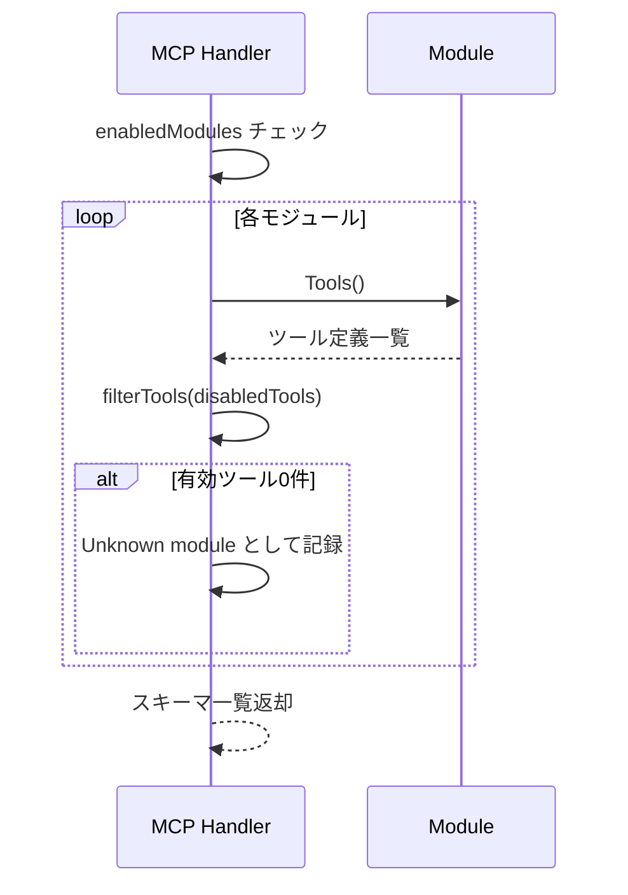
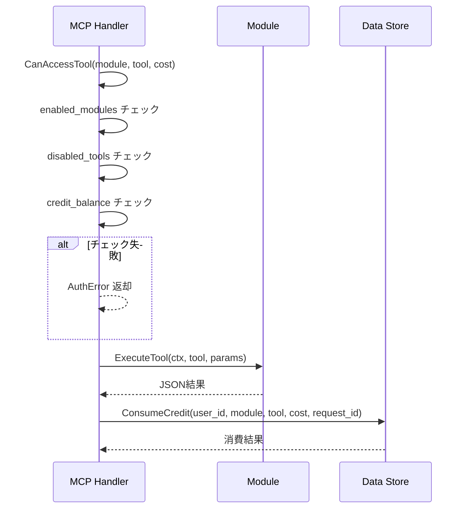
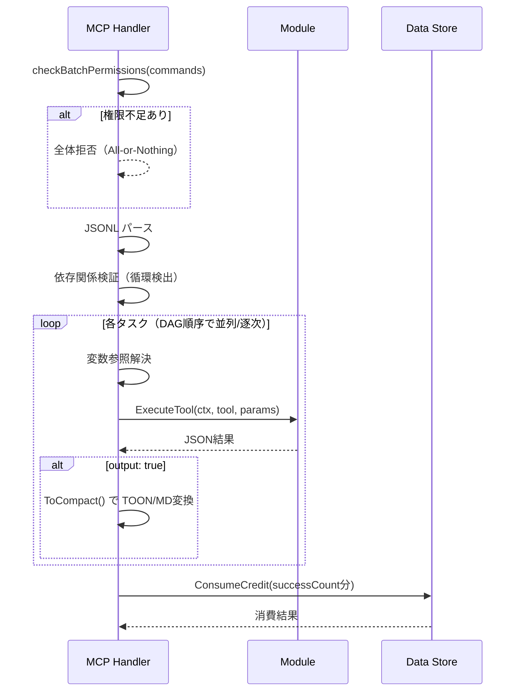

# HDL - MOD インタラクション詳細（dtl-itr-HDL-MOD）

## ドキュメント管理情報

| 項目      | 値                                        |
| ------- | ---------------------------------------- |
| Status  | `reviewed`                               |
| Version | v2.0                                     |
| Note    | MCP Handler - Modules Interaction Detail |

---

## 概要

| 項目 | 内容 |
|------|------|
| 連携元 | MCP Handler (HDL) |
| 連携先 | Modules (MOD) |
| 内容 | ツール実行委譲 |
| プロトコル | 内部関数呼び出し |

---

## 詳細

| 項目 | 内容 |
|------|------|
| トリガー | 権限チェック完了後 |
| 操作 | get_module_schema / run / batch |

---

## モジュールレジストリ

### 登録モジュール

| モジュール | 説明 |
|-----------|------|
| notion | Notion API（Page, Database, Block, Comment, User） |
| github | GitHub API（Repo, Issue, PR, Actions, Search） |
| jira | Jira API（Issue, Project, Comment, Transition） |
| confluence | Confluence API（Space, Page, Search, Label） |
| supabase | Supabase Management API（DB, Migration, Logs, Storage） |
| google_calendar | Google Calendar API（Calendar, Event） |
| microsoft_todo | Microsoft To Do API（List, Task） |

### Module インターフェース

```go
type Module interface {
    Name() string
    Description() string
    Tools() []Tool
    ExecuteTool(ctx context.Context, name string, params map[string]any) (string, error)
}
```

---

## get_module_schema

### リクエスト

| パラメータ | 型 | 説明 |
|-----------|-----|------|
| module | string / string[] | モジュール名（単一または配列） |

### 処理フロー



### フィルタリング

- `enabledModules` に含まれないモジュールは除外
- `disabledTools[module]` に含まれるツールは除外
- フィルタ後にツール数が0件の場合、そのモジュールは「Unknown module」として報告

---

## run（単一ツール実行）

### リクエスト

| パラメータ | 型 | 説明 |
|-----------|-----|------|
| module | string | モジュール名 |
| tool | string | ツール名 |
| params | object | ツールパラメータ |

### 処理フロー



### 権限チェック（CanAccessTool）

| チェック項目 | エラーコード |
|-------------|-------------|
| モジュールが enabledModules にない | MODULE_NOT_ENABLED |
| ツールが disabledTools にある | TOOL_DISABLED |
| free_credits + paid_credits < cost | INSUFFICIENT_CREDITS |

### レスポンス

```go
type ToolCallResult struct {
    Content []ContentBlock `json:"content"`
    IsError bool           `json:"isError,omitempty"`
}

type ContentBlock struct {
    Type string `json:"type"`  // "text"
    Text string `json:"text"`  // JSON文字列またはエラーメッセージ
}
```

---

## batch（複数ツール実行）

### リクエスト

JSONL形式で複数コマンドを指定。

| フィールド | 型 | 必須 | 説明 |
|-----------|-----|------|------|
| id | string | ✅ | タスク識別子 |
| module | string | ✅ | モジュール名 |
| tool | string | ✅ | ツール名 |
| params | object | - | ツールパラメータ |
| after | string[] | - | 依存タスクID（これらの完了後に実行） |
| output | boolean | - | true: TOON/Markdown形式で出力 |
| raw_output | boolean | - | true: JSON形式で出力（outputより優先） |

### JSONL例

```jsonl
{"id":"tasks","module":"microsoft_todo","tool":"list_tasks","params":{"listId":"AQMk..."},"output":true}
{"id":"daily","module":"microsoft_todo","tool":"list_tasks","params":{"listId":"AQMk..."},"output":true}
```

### 依存関係付き実行

```jsonl
{"id":"search","module":"notion","tool":"search","params":{"query":"design"}}
{"id":"page","module":"notion","tool":"get_page_content","params":{"page_id":"${search.results[0].id}"},"after":["search"],"output":true}
```

### 変数参照

パターン: `${taskId.results[index].field}`

依存タスクの結果から値を抽出してパラメータに代入。

### 処理フロー



### 実行ルール

| ルール | 説明 |
|--------|------|
| after なし | goroutineで並列実行 |
| after あり | 依存タスク完了後に実行 |
| 循環依存 | エラー |
| 依存タスク失敗 | 依存先はスキップ |

### レスポンス

```json
{
  "results": {
    "tasks": "...",
    "daily": "..."
  },
  "errors": {
    "failed_task": "error message"
  },
  "summary": "2/3 tasks succeeded"
}
```

---

## 出力変換（CompactConverter）

batch で `output: true` 指定時、モジュール固有の ToCompact() で TOON/Markdown 形式に変換。

| モジュール | 変換対象 |
|-----------|---------|
| notion | Page, Database, Block |
| github | Issue, PR, Actions |
| jira | Issue, Comment |

---

## クレジット消費

### 消費タイミング

| メソッド | タイミング |
|----------|-----------|
| run | ツール実行成功後 |
| batch | 全タスク完了後、successCount 分を消費 |

### 冪等性保証

| メソッド | 識別子 |
|----------|--------|
| run | request_id |
| batch | request_id + task_id |

---

## 監査ログ

### ツール実行ログ

| フィールド | 説明 |
|-----------|------|
| request_id | リクエスト追跡ID |
| module | モジュール名 |
| tool | ツール名 |
| duration_ms | 実行時間（ミリ秒） |
| status | success / error |

### セキュリティイベント

batch で権限不足が発生した場合、denied_tools を Loki に記録（クライアントには非公開）。

---

## 期待する振る舞い

### get_module_schema

- HDL は enabledModules と disabledTools でフィルタリングしたスキーマを返却する
- フィルタ後にツール数が0件のモジュールは「Unknown module」として報告する
- 複数モジュール指定時、一部失敗しても他のスキーマは返却する

### run

- HDL は CanAccessTool() で権限チェック後、modules.Run() でツール実行を委譲する
- 実行成功後、ConsumeCredit() でクレジットを消費する
- request_id により同一リクエストの重複消費を防止する

### batch

- HDL は全コマンドの権限を事前検証する（All-or-Nothing）
- 依存関係のないタスクは goroutine で並列実行する
- 変数参照 `${taskId.results[index].field}` を解決してからツールを実行する
- 循環依存を検出した場合はエラーを返却する
- 依存タスクが失敗した場合、依存先タスクはスキップされる

---

## 関連ドキュメント

| ドキュメント | 内容 |
|-------------|------|
| [itr-HDL.md](./itr-HDL.md) | MCP Handler 詳細仕様 |
| [itr-MOD.md](./itr-MOD.md) | Modules 詳細仕様 |
| [dtl-itr-DST-HDL.md](./dtl-itr-DST-HDL.md) | DST→HDL ユーザーコンテキスト・クレジット消費 |
| [dtl-itr-EXT-MOD.md](./dtl-itr-EXT-MOD.md) | MOD→EXT 外部API呼び出し |
