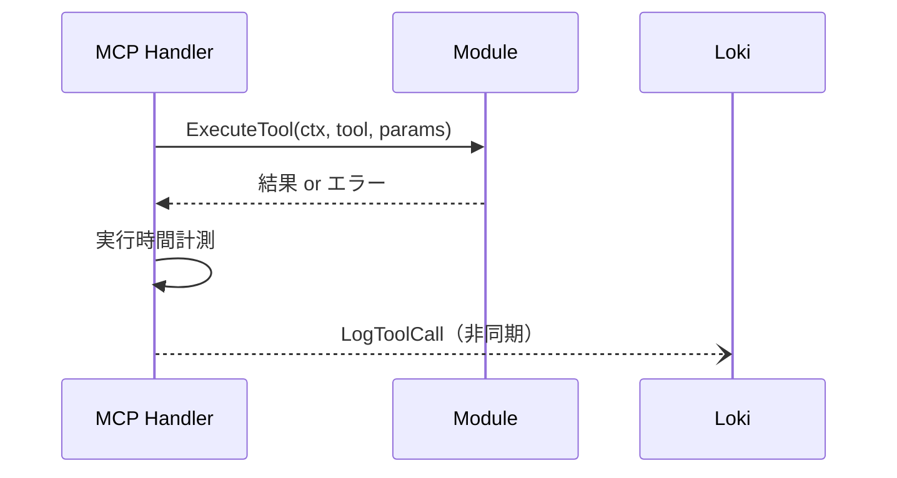

# HDL - OBS インタラクション詳細（dtl-itr-HDL-OBS）

## ドキュメント管理情報

| 項目      | 値                                              |
| ------- | ---------------------------------------------- |
| Status  | `reviewed`                                     |
| Version | v2.0                                           |
| Note    | MCP Handler - Observability Interaction Detail |

---

## 概要

| 項目 | 内容 |
|------|------|
| 連携元 | MCP Handler (HDL) |
| 連携先 | Observability (OBS) |
| 内容 | ツール実行ログ・セキュリティイベント送信 |
| プロトコル | HTTP（Loki Push API） |

---

## 詳細

| 項目 | 内容 |
|------|------|
| 送信方式 | 非同期（goroutine） |
| タイムアウト | 5秒 |
| 失敗時 | ベストエフォート（メイン処理は継続） |

---

## Loki Push API

### エンドポイント

```
POST {GRAFANA_LOKI_URL}/loki/api/v1/push
Authorization: Basic {username}:{apiKey}
Content-Type: application/json
```

### リクエスト形式

```json
{
  "streams": [
    {
      "stream": { "app": "mcpist-dev", "module": "notion", "tool": "search", "status": "success" },
      "values": [
        ["1672531200000000000", "{\"request_id\":\"abc123\",\"user_id\":\"user-456\",\"duration_ms\":250,...}"]
      ]
    }
  ]
}
```

---

## ツール実行ログ

### 送信タイミング

ツール実行完了時（成功/エラー両方）

### フィールド

| フィールド | 型 | 説明 |
|-----------|-----|------|
| request_id | string | リクエスト追跡ID |
| user_id | string | 実行ユーザーID |
| module | string | モジュール名 |
| tool | string | ツール名 |
| duration_ms | int64 | 実行時間（ミリ秒） |
| status | string | "success" または "error" |
| error | string | エラーメッセージ（失敗時のみ） |

### ラベル

| ラベル | 値 |
|--------|-----|
| app | mcpist-dev |
| module | モジュール名 |
| tool | ツール名 |
| status | success / error |

### 処理フロー



---

## セキュリティイベント

### 送信タイミング

セキュリティ異常検知時

### イベント種別

| event | 説明 | トリガー |
|-------|------|----------|
| batch_permission_denied | バッチ実行時の権限不足 | checkBatchPermissions() |
| invalid_gateway_secret | ゲートウェイシークレット不正 | ValidateRequest() |

### フィールド

| フィールド | 型 | 説明 |
|-----------|-----|------|
| request_id | string | リクエスト追跡ID |
| user_id | string | 対象ユーザーID |
| event | string | イベント種別 |
| details | map | イベント詳細（可変） |

### ラベル

| ラベル | 値 |
|--------|-----|
| app | mcpist-dev |
| type | security |
| level | warn |
| event | イベント種別 |
| maybe_attacked | true |

### details 例

**batch_permission_denied:**
```json
{
  "denied_tools": ["notion:search(MODULE_NOT_ENABLED)", "jira:create_issue(TOOL_DISABLED)"]
}
```

**invalid_gateway_secret:**
```json
{
  "remote_addr": "192.168.1.100",
  "user_agent": "curl/7.68.0"
}
```

---

## 期待する振る舞い

### ツール実行ログ

- HDL は run/batch でツール実行完了後、LogToolCall() で Loki にログを送信する
- ログ送信は goroutine で非同期実行され、メイン処理をブロックしない
- Loki 送信失敗時はローカルログに記録し、メイン処理は継続する
- user_id を含めてユーザー別の実行状況を追跡可能にする

### セキュリティイベント

- バッチ実行時に権限不足が検出された場合、denied_tools を記録する
- ゲートウェイシークレット不正時、リモートアドレス等を記録する
- クライアントには曖昧なエラーメッセージを返し、詳細はサーバーログにのみ記録する（情報隠蔽）
- `maybe_attacked: true` ラベルで異常検知クエリを容易にする

---

## 環境変数

| 変数 | 説明 | 必須 |
|------|------|------|
| GRAFANA_LOKI_URL | Loki サーバーURL | ✅ |
| GRAFANA_LOKI_USER | 認証ユーザー名 | ✅ |
| GRAFANA_LOKI_API_KEY | API キー | ✅ |

未設定の場合、ログ送信は無効化される（enabled: false）。

---

## 関連ドキュメント

| ドキュメント | 内容 |
|-------------|------|
| [itr-HDL.md](./itr-HDL.md) | MCP Handler 詳細仕様 |
| [itr-OBS.md](./itr-OBS.md) | Observability 詳細仕様 |
| [dtl-itr-GWY-OBS.md](./dtl-itr-GWY-OBS.md) | GWY→OBS リクエストログ |
