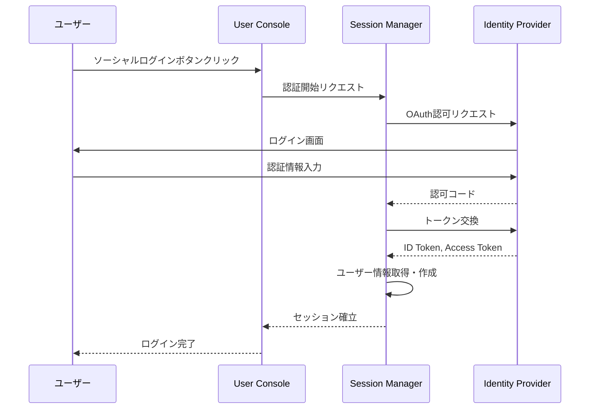

# IDP - SSM インタラクション詳細（dtl-itr-IDP-SSM）

## ドキュメント管理情報

| 項目 | 値 |
|------|-----|
| Status | `draft` |
| Version | v1.0 |
| ID | ITR-REL-019 |
| Note | Identity Provider - Session Manager Interaction Detail |

---

## 概要

| 項目 | 内容 |
|------|------|
| 連携元 | Session Manager (SSM) |
| 連携先 | Identity Provider (IDP) |
| 内容 | ソーシャルログイン |
| プロトコル | OAuth 2.0 / OpenID Connect |

---

## 詳細

| 項目 | 内容 |
|------|------|
| プロトコル | OAuth 2.0 / OpenID Connect |
| 用途 | ソーシャルログインによるユーザー認証 |

### 対応プロバイダ

- Google
- Apple
- Microsoft
- GitHub

### フロー

### SSMの処理

1. IDPから受け取ったID Tokenを検証
2. ユーザー情報（email, name等）を抽出
3. 既存ユーザーか確認
4. 新規の場合はユーザーレコード作成
5. セッショントークンを発行

---

## 関連ドキュメント

| ドキュメント | 内容 |
|-------------|------|
| [itr-ssm.md](./itr-ssm.md) | Session Manager 詳細仕様 |
| [itr-idp.md](./itr-idp.md) | Identity Provider 詳細仕様 |
| [idx-itr-rel.md](./idx-itr-rel.md) | インタラクション関係ID一覧 |
