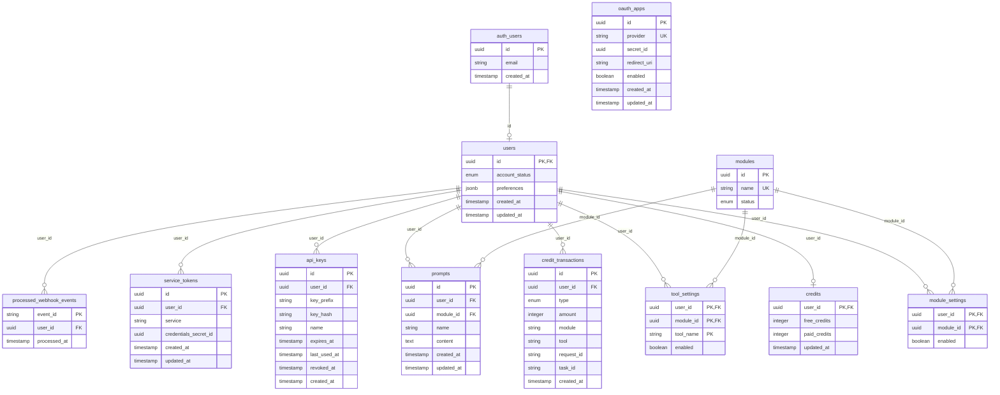

# テーブル設計書（dsn-tbl）

## ドキュメント管理情報

| 項目 | 値 |
|------|-----|
| Status | `draft` |
| Version | v1.0 |
| Note | Table Design |

---

## 概要

本ドキュメントは、MCPistのデータベーステーブル設計を定義する。

- テーブル仕様: [spc-tbl.md](../../002_specification/spc-tbl.md)
- 詳細設計（列定義・制約・インデックス）: [dtl-dsn-tbl.md](./dtl-dsn-tbl.md)

---

## ER図



---

## テーブル関係

### 1:1 リレーション

| 親テーブル | 子テーブル | 説明 |
|-----------|-----------|------|
| auth.users | users | Supabase Auth連携 |
| users | credits | ユーザーごとのクレジット残高 |

### 1:N リレーション

| 親テーブル | 子テーブル | 説明 |
|-----------|-----------|------|
| users | credit_transactions | クレジット増減履歴 |
| users | module_settings | ユーザー×モジュール設定 |
| users | tool_settings | ユーザー×ツール設定 |
| users | prompts | ユーザー定義プロンプト |
| users | api_keys | MCP接続用APIキー |
| users | service_tokens | 外部サービス連携トークン |
| users | processed_webhook_events | 処理済みWebhookイベント |
| modules | module_settings | モジュールマスタ参照 |
| modules | tool_settings | モジュールマスタ参照 |
| modules | prompts | モジュールマスタ参照 |

---

## 主キー設計

| テーブル | 主キー | 種別 |
|---------|--------|------|
| users | id | UUID（auth.usersと同一） |
| credits | user_id | UUID（1:1） |
| credit_transactions | id | UUID |
| modules | id | UUID |
| module_settings | (user_id, module_id) | 複合PK |
| tool_settings | (user_id, module_id, tool_name) | 複合PK |
| prompts | id | UUID |
| api_keys | id | UUID |
| service_tokens | id | UUID |
| oauth_apps | id | UUID |
| processed_webhook_events | event_id | 文字列（PSPのevent.id） |

---

## 外部キー制約

| テーブル | 列 | 参照先 | ON DELETE |
|---------|-----|--------|-----------|
| users | id | auth.users(id) | CASCADE |
| credits | user_id | users(id) | CASCADE |
| credit_transactions | user_id | users(id) | CASCADE |
| module_settings | user_id | users(id) | CASCADE |
| module_settings | module_id | modules(id) | RESTRICT |
| tool_settings | user_id | users(id) | CASCADE |
| tool_settings | module_id | modules(id) | RESTRICT |
| prompts | user_id | users(id) | CASCADE |
| prompts | module_id | modules(id) | SET NULL |
| api_keys | user_id | users(id) | CASCADE |
| service_tokens | user_id | users(id) | CASCADE |
| processed_webhook_events | user_id | users(id) | CASCADE |

**ON DELETE方針:**
- users削除時: 関連データをすべて削除（CASCADE）
- modules削除時: 設定がある場合は削除不可（RESTRICT）、promptsのみSET NULL

---

## ユニーク制約

| テーブル | 列 | 説明 |
|---------|-----|------|
| modules | name | モジュール名の一意性 |
| api_keys | key_hash | ハッシュの一意性 |
| service_tokens | (user_id, service) | ユーザー×サービスの一意性 |
| oauth_apps | provider | プロバイダの一意性 |
| prompts | (user_id, module_id, name) | ユーザー×モジュール内でのプロンプト名一意性 |

---

## Enum定義

### account_status

```sql
CREATE TYPE mcpist.account_status AS ENUM (
    'active',
    'suspended',
    'disabled'
);
```

### module_status

```sql
CREATE TYPE mcpist.module_status AS ENUM (
    'active',
    'coming_soon',
    'maintenance',
    'beta',
    'deprecated',
    'disabled'
);
```

### credit_transaction_type

```sql
CREATE TYPE mcpist.credit_transaction_type AS ENUM (
    'consume',
    'purchase',
    'monthly_reset'
);
```

---

## service_tokens テーブル

ユーザーの外部サービス連携トークンを管理する。トークン本体はVaultに暗号化保存。

| 列 | 型 | 説明 |
|-----|-----|------|
| id | UUID | 主キー |
| user_id | UUID | ユーザーID（auth.users参照） |
| service | TEXT | サービス名（notion, google_calendar等） |
| credentials_secret_id | UUID | vault.secretsへの参照 |
| created_at | TIMESTAMPTZ | 作成日時 |
| updated_at | TIMESTAMPTZ | 更新日時 |

---

## oauth_apps テーブル

管理者がOAuthクライアント情報を管理するためのテーブル。

| 列 | 型 | 説明 |
|-----|-----|------|
| id | UUID | 主キー |
| provider | TEXT | プロバイダ名（google, microsoft）、ユニーク |
| secret_id | UUID | vault.secretsへの参照（client_id, client_secret） |
| redirect_uri | TEXT | OAuthコールバックURL |
| enabled | BOOLEAN | このプロバイダが有効か |
| created_at | TIMESTAMPTZ | 作成日時 |
| updated_at | TIMESTAMPTZ | 更新日時 |

---

## Token Vault（vault.secrets）

MCPistはSupabase Vaultを使用してユーザートークンを暗号化保存する。

### 命名規則

```
{user_id}:{service}
```

**例:**
- `e9467a51-a385-488f-86d0-16b68385ed04:notion`
- `e9467a51-a385-488f-86d0-16b68385ed04:github`

### vault.secretsの構造

| 列 | 型 | 説明 |
|-----|-----|------|
| id | uuid | PK（Supabase生成） |
| name | text | 命名規則に従った識別子 |
| description | text | サービス説明 |
| secret | bytea | 暗号化されたトークン（JSON） |
| created_at | timestamp | 作成日時 |

### 保存形式（secret列のJSON）

```json
{
  "access_token": "xxx",
  "refresh_token": "yyy",
  "expires_at": "2026-01-24T12:00:00Z"
}
```

---

## 初期データ

### modules（マスタデータ）

```sql
INSERT INTO mcpist.modules (id, name, status) VALUES
    (gen_random_uuid(), 'notion', 'active'),
    (gen_random_uuid(), 'github', 'active'),
    (gen_random_uuid(), 'jira', 'active'),
    (gen_random_uuid(), 'confluence', 'active'),
    (gen_random_uuid(), 'supabase', 'beta'),
    (gen_random_uuid(), 'google_calendar', 'active'),
    (gen_random_uuid(), 'microsoft_todo', 'active'),
    (gen_random_uuid(), 'rag', 'active');
```

---

## 関連ドキュメント

| ドキュメント | 内容 |
|-------------|------|
| [spc-tbl.md](../../002_specification/spc-tbl.md) | テーブル仕様書 |
| [spc-itr.md](../../002_specification/interaction/spc-itr.md) | インタラクション仕様書 |
| [dtl-spc-credit-model.md](../../002_specification/dtl-spc/dtl-spc-credit-model.md) | クレジットモデル詳細仕様 |
| [dtl-dsn-tbl.md](./dtl-dsn-tbl.md) | テーブル詳細設計書 |
