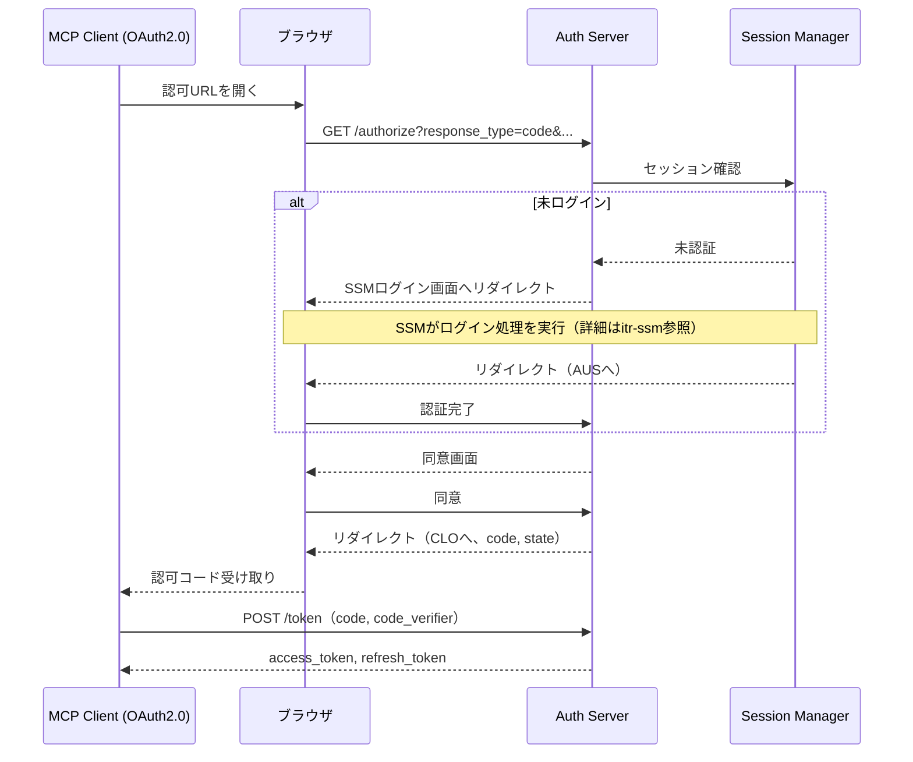

# Auth Server インタラクション仕様書（itr-aus）

## ドキュメント管理情報

| 項目 | 値 |
|------|-----|
| Status | `reviewed` |
| Version | v2.0 |
| Note | Auth Server Interaction Specification |

---

## 概要

Auth Server（AUS）は、OAuth 2.1準拠の認可サーバー。MCP Client (OAuth2.0) およびUser Consoleに対してOAuth 2.1認証フローを提供する。

**実装:** Supabase Auth

主な責務：
- OAuth 2.1 + PKCE認証フローの提供
- JWT（access_token）の発行
- JWKS公開鍵の提供
- トークンリフレッシュ

---

## 連携サマリー（spc-itrより）

| 相手 | 方向 | やり取り |
|------|------|----------|
| MCP Client (OAuth2.0) | AUS ← CLO | OAuth 2.1認証リクエスト受付 |
| API Gateway | AUS → GWY | JWT提供 |
| Session Manager | AUS ↔ SSM | ユーザー認証連携 |

---

## 連携詳細

### CLO → AUS（MCP Client からの認可リクエスト）

| 項目 | 内容 |
|------|------|
| プロトコル | HTTPS |
| 認証方式 | OAuth 2.1 + PKCE |
| 参照仕様 | [OAuth 2.1](https://datatracker.ietf.org/doc/html/draft-ietf-oauth-v2-1-12), [RFC 7636 (PKCE)](https://datatracker.ietf.org/doc/html/rfc7636), [RFC 8707 (Resource Indicators)](https://datatracker.ietf.org/doc/html/rfc8707) |

MCP Clientからの認可リクエストを受け付け、ログイン・同意画面を経てaccess_tokenを発行する。

**実装方式:**

AUSはSession Manager（SSM）と連携してユーザー認証を行う。ログインの詳細（認証方式等）はSSMが担当する。



**認可リクエスト（/authorize）:**

| パラメータ                 | 必須  | 説明                                                    |
| --------------------- | --- | ----------------------------------------------------- |
| response_type         | Yes | `code`（認可コードフロー）                                      |
| client_id             | Yes | クライアント識別子                                             |
| redirect_uri          | Yes | 認可コード返却先                                              |
| scope                 | Yes | 要求スコープ（`openid profile`等）                             |
| code_challenge        | Yes | PKCE code_challenge（S256）                             |
| code_challenge_method | Yes | `S256`                                                |
| state                 | Yes | CSRF対策用ランダム文字列                                        |
| resource              | No  | RFC 8707 Resource Indicator（`{MCP Server Domain}`） |

**トークンリクエスト（/token）:**

| パラメータ | 必須 | 説明 |
|-----------|------|------|
| grant_type | Yes | `authorization_code` または `refresh_token` |
| code | Yes* | 認可コード（authorization_code時） |
| redirect_uri | Yes* | 認可リクエスト時と同一（authorization_code時） |
| client_id | Yes | クライアント識別子 |
| code_verifier | Yes* | PKCE code_verifier（authorization_code時） |
| refresh_token | Yes* | リフレッシュトークン（refresh_token時） |
| resource | No | RFC 8707 Resource Indicator |

**トークンレスポンス:**

```json
{
  "access_token": "eyJ...",
  "token_type": "Bearer",
  "expires_in": 3600,
  "refresh_token": "..."
}
```

---

### AUS → GWY（JWT提供）

| 項目      | 内容                                           |
| ------- | -------------------------------------------- |
| 方向      | GWY が AUS の JWKS を取得                         |
| エンドポイント | `{Auth Server Domain}/.well-known/jwks.json` |
| 用途      | JWT署名検証用公開鍵の提供                               |
| キャッシュ   | Cache-Controlヘッダーを返却                     |

GWYはAUSからJWKSを取得し、MCP ClientからのJWTを検証する。

**JWKSレスポンス例（[RFC 7517](https://datatracker.ietf.org/doc/html/rfc7517) 準拠）:**

```json
{
  "keys": [
    {
      "kty": "RSA",
      "kid": "key-id-1",
      "use": "sig",
      "alg": "RS256",
      "n": "...",
      "e": "AQAB"
    }
  ]
}
```

---

### AUS ↔ SSM（ユーザー認証連携）

| 項目 | 内容 |
|------|------|
| 方向 | AUS ↔ SSM |
| 用途 | OAuth 2.1認可フローにおけるユーザー認証 |
| トリガー | /authorize リクエスト時 |
| 実装 | Supabase Auth内部処理（実装範囲外） |

AUSは認可リクエスト時にSSMと連携し、ユーザーのログイン状態を確認する。

**フロー:**
1. AUSが/authorizeリクエストを受信
2. SSMにセッション確認を依頼
3. 未ログインの場合、SSMのログインフローにリダイレクト
4. ログイン完了後、SSMがAUSにユーザー情報を返却
5. AUSが同意画面を表示し、認可コードを発行

ログイン処理の詳細（認証方式、IDP連携等）は [itr-ssm.md](./itr-ssm.md) を参照。

**SSMから取得する情報:**
- user_id（Supabase Auth UUID）
- email
- display_name

---

## エンドポイント一覧

| エンドポイント | メソッド | 用途 | 準拠仕様 |
|---------------|--------|------|----------|
| `/.well-known/openid-configuration` | GET | メタデータ | [OpenID Connect Discovery 1.0](https://openid.net/specs/openid-connect-discovery-1_0.html) |
| `/authorize` | GET | 認可リクエスト | [OAuth 2.1](https://datatracker.ietf.org/doc/html/draft-ietf-oauth-v2-1-12), [RFC 7636 (PKCE)](https://datatracker.ietf.org/doc/html/rfc7636) |
| `/token` | POST | トークン交換・リフレッシュ | OAuth 2.1 |
| `/.well-known/jwks.json` | GET | JWT検証用公開鍵 | [RFC 7517 (JWK)](https://datatracker.ietf.org/doc/html/rfc7517) |

---

## メタデータエンドポイント

### /.well-known/openid-configuration

[OpenID Connect Discovery 1.0](https://openid.net/specs/openid-connect-discovery-1_0.html) 準拠。

**メタデータ例:**

```json
{
  "issuer": "{Auth Server Domain}",
  "authorization_endpoint": "{Auth Server Domain}/authorize",
  "token_endpoint": "{Auth Server Domain}/token",
  "jwks_uri": "{Auth Server Domain}/.well-known/jwks.json",
  "response_types_supported": ["code"],
  "grant_types_supported": ["authorization_code", "refresh_token"],
  "code_challenge_methods_supported": ["S256"],
  "token_endpoint_auth_methods_supported": ["none"],
  "scopes_supported": ["openid", "profile", "email"]
}
```

---

## JWT（access_token）仕様

[RFC 7519 (JWT)](https://datatracker.ietf.org/doc/html/rfc7519)、[RFC 7515 (JWS)](https://datatracker.ietf.org/doc/html/rfc7515) 準拠。

| 項目 | 内容 |
|------|------|
| 形式 | JWT（JWS、RS256署名） |
| 有効期限 | 3600秒（1時間） |
| 検証 | JWKS公開鍵による署名検証 |

**JWTペイロード例:**

```json
{
  "iss": "{Auth Server Domain}",
  "sub": "user-uuid",
  "aud": "authenticated",
  "exp": 1234567890,
  "iat": 1234564290,
  "scope": "openid profile"
}
```

| クレーム | 説明 |
|----------|------|
| iss | 発行者（Auth Server） |
| sub | ユーザー識別子（user_id） |
| aud | 対象リソース（MCP Server） |
| exp | 有効期限（Unix timestamp） |
| iat | 発行日時（Unix timestamp） |
| scope | 許可されたスコープ |

---

## AUSが直接やり取りしないコンポーネント

| コンポーネント | 理由 |
|----------------|------|
| MCP Client (API KEY) (CLK) | API KEY認証はTVL担当 |
| Data Store (DST) | SSM経由（DBトリガーでユーザー作成） |
| Token Vault (TVL) | 外部サービストークン管理 |
| Auth Middleware (AMW) | GWY経由でJWKS取得 |
| MCP Handler (HDL) | MCP Server内部 |
| Modules (MOD) | MCP Server内部 |
| User Console (CON) | 認可フローのリダイレクト先（直接連携ではない） |
| Identity Provider (IDP) | SSM経由 |
| External Auth Server (EAS) | 外部サービス認証専用 |
| External Service API (EXT) | MOD経由 |
| Payment Service Provider (PSP) | 課金専用 |

---

## 関連ドキュメント

| ドキュメント | 内容 |
|-------------|------|
| [spc-sys.md](../spc-sys.md) | システム仕様書 |
| [spc-itr.md](../spc-itr.md) | インタラクション仕様書 |
| [itr-clo.md](./itr-clo.md) | MCP Client (OAuth2.0)詳細仕様 |
| [itr-gwy.md](./itr-gwy.md) | API Gateway詳細仕様 |
| [itr-ssm.md](./itr-ssm.md) | Session Manager詳細仕様 |
