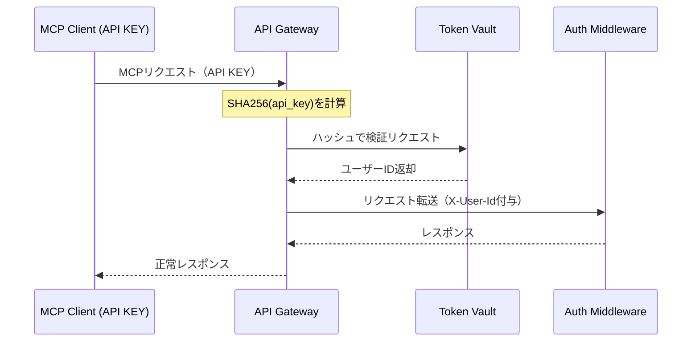

# MCP Client (API KEY) インタラクション仕様書（itr-clk）

## ドキュメント管理情報

| 項目 | 値 |
|------|-----|
| Status | `reviewed` |
| Version | v2.0 |
| Note | MCP Client (API KEY) Interaction Specification - 実装範囲外 |

---

## 概要

MCP Client (API KEY)（CLK）は、LLM Host（Claude Code, Cursor等）からMCP Serverへ接続するクライアント。API KEY認証を使用する。

**実装範囲外**だが、他コンポーネントとのやり取りを明確にするため仕様を記載する。

OAuth 2.1よりシンプルな認証方式で、主にサーバーサイドアプリケーションや自動化ツールでの利用を想定。

---

## 連携サマリー（spc-itrより）

| 相手 | 方向 | やり取り |
|------|------|----------|
| API Gateway | CLK → GWY | MCP通信（JSON-RPC over SSE） |

---

## 連携詳細

### CLK → GWY（MCP通信）

| 項目 | 内容 |
|------|------|
| プロトコル | [MCP Protocol 2025-11-25](https://modelcontextprotocol.io/specification/2025-11-25)（JSON-RPC 2.0 over Streamable HTTP） |
| 認証方式 | API KEY（Bearer Token形式） |
| エンドポイント | `https://mcp.mcpist.app/mcp` |

**API KEY形式:**
```
mcpist_{random_string_32chars}
```

**リクエストヘッダー（MCP仕様準拠）:**

[Transports](https://modelcontextprotocol.io/specification/2025-11-25/basic/transports):
```
Accept: application/json, text/event-stream
MCP-Protocol-Version: 2025-11-25
MCP-Session-Id: {session_id}
```

[Authorization](https://modelcontextprotocol.io/specification/2025-11-25/basic/authorization):
```
Authorization: Bearer mcpist_xxx
```

HTTP標準:
```
Content-Type: application/json
```

CLKはMCPプリミティブ（Tools, Resources, Prompts）をJSON-RPCリクエストとして送信する。詳細は [spc-itf.md](../spc-itf.md) を参照。

---

### 認証フロー



**API KEY検証:**
1. CLKがAPI KEYでリクエスト
2. GWYがAPI KEYのSHA256ハッシュを計算（平文は即破棄）
3. GWYがTVLにハッシュで検証を依頼
4. TVLがハッシュからユーザーIDを特定
5. 検証成功時：GWYがX-User-Idヘッダーを付与してAMWへ転送
6. 検証失敗時：401 Unauthorized返却

---

### API KEY取得方法

API KEYはUser Console（CON）で発行する。ユーザーは発行されたAPI KEYをCLKの設定（環境変数やconfig等）に設定し、リクエスト時にAuthorizationヘッダーに付与する。

**注意事項:**
- API KEYは発行時に一度だけ表示される（再表示不可）
- 紛失した場合は再発行が必要
- 発行フローの詳細は [itr-con.md](./itr-con.md) を参照

---

## CLKが保持するデータ

| データ | 用途 |
|--------|------|
| api_key | MCP Serverへのリクエストに使用 |

OAuth 2.1と異なり、refresh_tokenやトークン有効期限の管理は不要。

---

## CLKが直接やり取りしないコンポーネント

| コンポーネント | 理由 |
|----------------|------|
| MCP Client (OAuth2.0) (CLO) | 別の認証方式 |
| Auth Server (AUS) | OAuth 2.1専用 |
| Session Manager (SSM) | OAuth 2.1専用 |
| Data Store (DST) | サーバー側 |
| Token Vault (TVL) | GWY経由（CLKから直接アクセスしない） |
| Auth Middleware (AMW) | GWY経由 |
| MCP Handler (HDL) | GWY経由 |
| Modules (MOD) | GWY経由 |
| User Console (CON) | API KEY発行時のみ（クライアント利用時は直接やり取りなし） |
| Identity Provider (IDP) | OAuth 2.1専用 |
| External Auth Server (EAS) | CON経由 |
| External Service API (EXT) | MOD経由 |
| Payment Service Provider (PSP) | CON経由 |

---

## 関連ドキュメント

| ドキュメント | 内容 |
|-------------|------|
| [spc-sys.md](../spc-sys.md) | システム仕様書 |
| [spc-itr.md](../spc-itr.md) | インタラクション仕様書 |
| [itr-tvl.md](./itr-tvl.md) | Token Vault詳細仕様 |
| [itr-gwy.md](./itr-gwy.md) | API Gateway詳細仕様 |
| [itr-clo.md](./itr-clo.md) | MCP Client (OAuth2.0)詳細仕様 |
