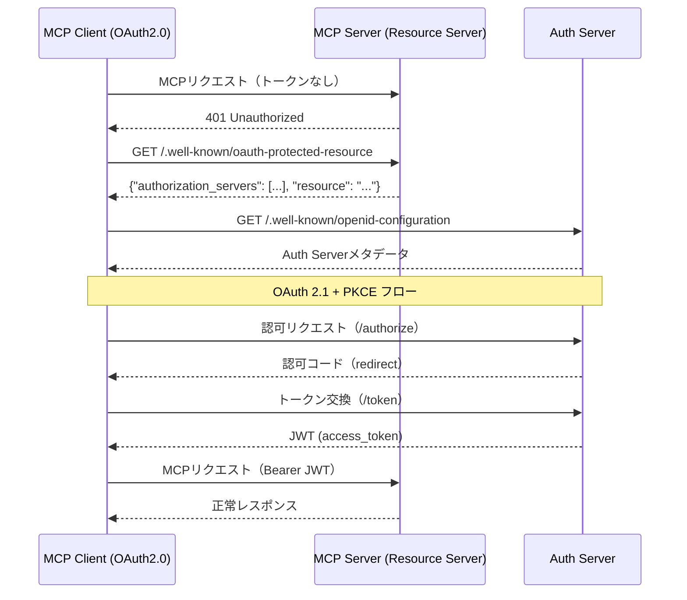

# MCP Client (OAuth2.0) インタラクション仕様書（itr-clo）

## ドキュメント管理情報

| 項目 | 値 |
|------|-----|
| Status | `reviewed` |
| Version | v2.0 |
| Note | MCP Client (OAuth2.0) Interaction Specification - 実装範囲外 |

---

## 概要

MCP Client (OAuth2.0)（略号: CLO）は、LLM Host（Claude Code, Cursor等）の一部として実装され，MCP Serverへ接続するクライアント。OAuth 2.1認証を使用する。

**実装範囲外**だが、他コンポーネントとのやり取りを明確にするため仕様を記載する。

---

## 連携サマリー（spc-itrより）

| 相手 | 方向 | やり取り |
|------|------|----------|
| API Gateway | CLO → GWY | MCP通信（JSON-RPC over SSE） |
| Auth Server | CLO → AUS | OAuth 2.1認証フロー（認可コード、トークン交換） |

---

## 連携詳細

### CLO → GWY（MCP通信）

| 項目      | 内容                                                                                                                     |
| ------- | ---------------------------------------------------------------------------------------------------------------------- |
| プロトコル   | [MCP Protocol 2025-11-25](https://modelcontextprotocol.io/specification/2025-11-25)（JSON-RPC 2.0 over Streamable HTTP） |
| 認証      | Bearer Token（JWT）                                                                                                      |
| エンドポイント | `https://mcp.mcpist.app/mcp`                                                                                           |

**リクエストヘッダー（MCP仕様準拠）:**

[Transports](https://modelcontextprotocol.io/specification/2025-11-25/basic/transports):
```
Accept: application/json, text/event-stream
MCP-Protocol-Version: 2025-11-25
MCP-Session-Id: {session_id}
```

[Authorization](https://modelcontextprotocol.io/specification/2025-11-25/basic/authorization):
```
Authorization: Bearer {access_token}
```

HTTP標準:
```
Content-Type: application/json
```

CLOはMCPプリミティブ（Tools, Resources, Prompts）をJSON-RPCリクエストとして送信する。詳細は [spc-itf.md](../spc-itf.md) を参照。

---

### CLO → AUS（OAuth 2.1認証フロー）

| 項目 | 内容 |
|------|------|
| プロトコル | HTTPS |
| 認証方式 | OAuth 2.1 + PKCE |
| 参照仕様 | [OAuth 2.1](https://datatracker.ietf.org/doc/html/draft-ietf-oauth-v2-1-12), [RFC 7636 (PKCE)](https://datatracker.ietf.org/doc/html/rfc7636), [RFC 8707 (Resource Indicators)](https://datatracker.ietf.org/doc/html/rfc8707) |

#### 初回認可フロー



#### OAuth 2.1 + PKCEフロー詳細

**1. 認可リクエスト:**
```
GET /authorize
  ?response_type=code
  &client_id={client_id}
  &redirect_uri={redirect_uri}
  &scope=openid profile
  &code_challenge={code_challenge}
  &code_challenge_method=S256
  &state={state}
  &resource=https://mcp.mcpist.app
```

**2. 認可コード返却:**
```
{redirect_uri}?code={code}&state={state}
```

**3. トークン交換:**
```
POST /token
  grant_type=authorization_code
  &code={code}
  &redirect_uri={redirect_uri}
  &client_id={client_id}
  &code_verifier={code_verifier}
  &resource=https://mcp.mcpist.app
```

**4. トークンレスポンス:**
```json
{
  "access_token": "eyJ...",
  "token_type": "Bearer",
  "expires_in": 3600,
  "refresh_token": "..."
}
```

---

## CLOが保持するデータ

| データ | 用途 |
|--------|------|
| access_token | MCP Serverへのリクエストに使用 |
| refresh_token | トークン更新に使用 |
| expires_in | トークン有効期限 |
| code_verifier | PKCE検証用（トークン交換時に使用） |

---

## CLOが直接やり取りしないコンポーネント

| コンポーネント | 理由 |
|----------------|------|
| MCP Client (API KEY) (CLK) | 別の認証方式 |
| Session Manager (SSM) | AUS経由 |
| Data Store (DST) | サーバー側 |
| Token Vault (TVL) | サーバー側 |
| Auth Middleware (AMW) | GWY経由 |
| MCP Handler (HDL) | GWY経由 |
| Modules (MOD) | GWY経由 |
| User Console (CON) | 別アプリケーション |
| Identity Provider (IDP) | SSM経由 |
| External Auth Server (EAS) | CON経由 |
| External Service API (EXT) | MOD経由 |
| Payment Service Provider (PSP) | CON経由 |

---

## 関連ドキュメント

| ドキュメント | 内容 |
|-------------|------|
| [spc-sys.md](../spc-sys.md) | システム仕様書 |
| [spc-itr.md](../spc-itr.md) | インタラクション仕様書 |
| [itr-gwy.md](./itr-gwy.md) | API Gateway詳細仕様 |
| [itr-aus.md](./itr-aus.md) | Auth Server詳細仕様 |
| [itr-clk.md](./itr-clk.md) | MCP Client (API KEY)詳細仕様 |
