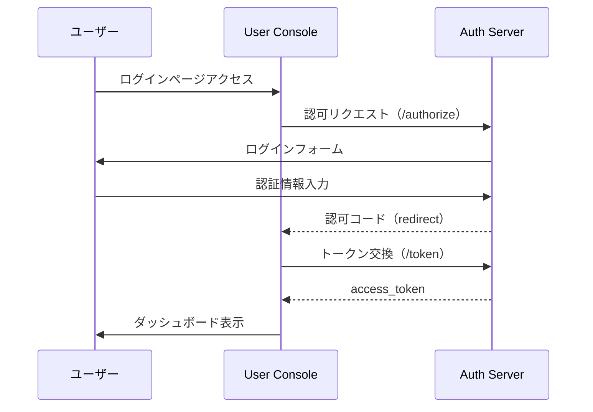
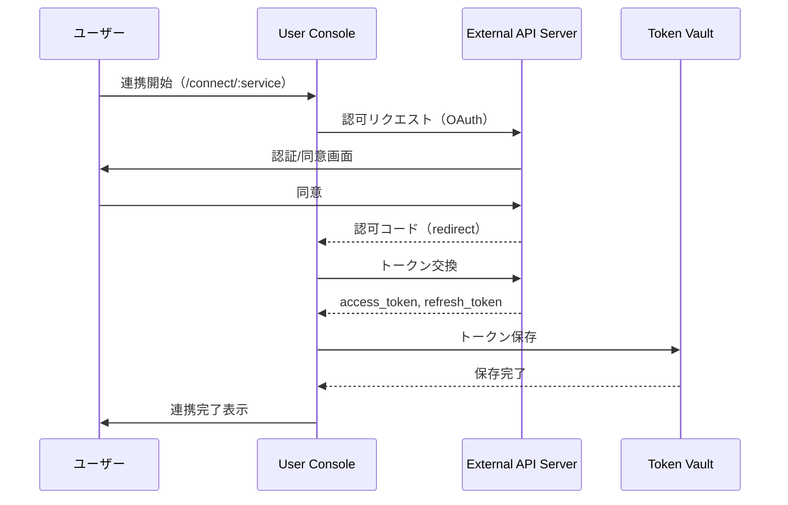

# User Console 詳細仕様書（itr-con）

## ドキュメント管理情報

| 項目 | 値 |
|------|-----|
| Status | `draft` |
| Version | v1.0 (DAY8) |
| Note | User Console Interaction Specification |

---

## 概要

User Console（CON）は、ユーザーが自分の設定を管理するWebアプリケーション。

主な機能：
- ユーザー認証（ログイン/ログアウト）
- OAuth同意画面の提供（MCP Client認可時）
- 外部サービス連携（OAuth認可フロー）
- 権限設定（モジュール有効/無効、課金管理）

### 連携サマリー（spc-itrより）

| 相手                  | 方向         | やり取り                |
| ------------------- | ---------- | ------------------- |
| MCP Client          | -          | 直接やり取りなし            |
| Auth Server         | CON → AUS | ユーザー認証（ログイン）        |
| MCP Server          | -          | 直接やり取りなし            |
| Auth Middleware     | -          | 直接やり取りなし            |
| MCP Handler         | -          | 直接やり取りなし            |
| Module Registry     | -          | 直接やり取りなし            |
| Modules             | -          | 直接やり取りなし            |
| Entitlement Store   | CON → ENT  | 設定の読み書き             |
| Token Vault         | CON → TVL  | OAuthトークン登録         |
| External API Server | CON → EXT  | OAuth認可フロー（認可コード取得） |

---

## 連携詳細

### CON → AUS（ユーザー認証）

| 項目 | 内容 |
|------|------|
| プロトコル | HTTPS |
| 認証方式 | OAuth 2.1 + PKCE |
| 用途 | User Consoleへのログイン |

User ConsoleはAUSを使用してユーザー認証を行う。フローはCLT → AUSと同様。

---

### CON → ENT（設定の読み書き）

| 項目 | 内容 |
|------|------|
| 用途 | ユーザー設定の管理 |
| 操作 | モジュール有効/無効、課金状態、プラン変更 |

**管理対象の設定：**
- 有効なモジュール一覧
- 各モジュールの個別設定
- 課金プラン
- アカウント状態

詳細は spc-ent.md（TBD）を参照。

---

### CON → TVL（OAuthトークン登録）

| 項目 | 内容 |
|------|------|
| 用途 | 外部サービスのOAuthトークン保存 |
| タイミング | 外部サービス連携完了時 |

ユーザーが外部サービス（Notion, GitHub等）と連携する際、取得したトークンをToken Vaultに保存する。

詳細は spc-tvl.md（TBD）を参照。

---

### CON → EXT（外部サービス連携）

| 項目 | 内容 |
|------|------|
| 用途 | 外部サービスへのOAuth認可フロー |
| フロー | OAuth 2.0 Authorization Code Flow |

**対応サービス：**
- Notion
- Google Calendar
- Microsoft To Do

---

## CONが直接やり取りしないコンポーネント

| コンポーネント | 理由 |
|----------------|------|
| MCP Client (CLT) | 別アプリケーション |
| MCP Server (SRV) | 別アプリケーション |
| Auth Middleware (AMW) | MCP Server内部 |
| MCP Handler (HDL) | MCP Server内部 |
| Module Registry (REG) | MCP Server内部 |
| Modules (MOD) | MCP Server内部 |

---

## 関連ドキュメント

| ドキュメント | 内容 |
|-------------|------|
| [spc-sys.md](../spc-sys.md) | システム仕様書 |
| [spc-itr.md](../spc-itr.md) | インタラクション仕様書 |
| [itr-aus.md](./itr-aus.md) | Auth Server詳細仕様 |
| [idx-ept.md](./idx-ept.md) | エンドポイント一覧 |
