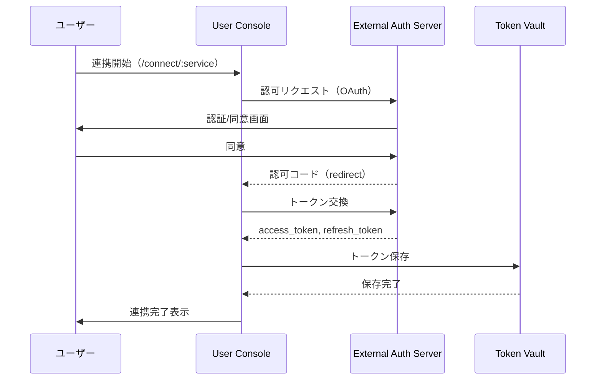

# External Auth Server インタラクション仕様書（itr-eas）

## ドキュメント管理情報

| 項目 | 値 |
|------|-----|
| Status | `reviewed` |
| Version | v2.0 |
| Note | External Auth Server Interaction Specification - 実装範囲外 |

---

## 概要

External Auth Server（EAS）は、外部サービス（Notion, Google Calendar等）のOAuth認証を提供する認可サーバー。

**実装範囲外**だが、他コンポーネントとのやり取りを明確にするため仕様を記載する。

External Service API（EXT）と同一サービス内で連携する。

---

## 連携サマリー（spc-itrより）

| 相手 | 方向 | やり取り |
|------|------|----------|
| User Console | EAS ← CON | 認可フロー受付 |
| External Service API | EAS ↔ EXT | 同一サービス内連携 |

---

## 連携詳細

### CON → EAS（認可フロー受付）

| 項目 | 内容 |
|------|------|
| プロトコル | OAuth 2.0 |
| 用途 | 外部サービスへのアクセス権限取得 |

**フロー:**


---

### 認可リクエスト例（Notion）

```
GET https://api.notion.com/v1/oauth/authorize
  ?client_id={client_id}
  &redirect_uri={redirect_uri}
  &response_type=code
  &owner=user
  &state={state}
```

### トークン交換リクエスト例（Notion）

```
POST https://api.notion.com/v1/oauth/token
Content-Type: application/json

{
  "grant_type": "authorization_code",
  "code": "{code}",
  "redirect_uri": "{redirect_uri}"
}
```

**レスポンス:**
```json
{
  "access_token": "ntn_xxx",
  "token_type": "Bearer",
  "bot_id": "xxx",
  "workspace_id": "xxx",
  "workspace_name": "My Workspace"
}
```

---

### EAS ↔ EXT（同一サービス内連携）

| 項目 | 内容 |
|------|------|
| 関係 | 同一外部サービス内のコンポーネント |
| 用途 | 認証とAPIが同一サービスで提供される |

例：
- Notion Auth Server（EAS） → Notion API（EXT）
- Google OAuth（EAS） → Google Calendar API（EXT）

トークンはEASで発行され、EXTへのアクセスに使用される。

---

## EASが直接やり取りしないコンポーネント

| コンポーネント | 理由 |
|----------------|------|
| MCP Client (CLO/CLK) | MCP通信専用 |
| API Gateway (GWY) | MCP通信専用 |
| Auth Server (AUS) | MCPist内部認証専用 |
| Session Manager (SSM) | ソーシャルログイン専用 |
| Data Store (DST) | CON経由 |
| Auth Middleware (AMW) | MCP Server内部 |
| MCP Handler (HDL) | MCP Server内部 |
| Modules (MOD) | TVL経由 |
| Identity Provider (IDP) | ソーシャルログイン専用 |
| Payment Service Provider (PSP) | 課金専用 |

---

## 関連ドキュメント

| ドキュメント | 内容 |
|-------------|------|
| [spc-sys.md](../spc-sys.md) | システム仕様書 |
| [spc-itr.md](../spc-itr.md) | インタラクション仕様書 |
| [itr-con.md](./itr-con.md) | User Console詳細仕様 |
| [itr-tvl.md](./itr-tvl.md) | Token Vault詳細仕様 |
| [itr-ext.md](./itr-ext.md) | External Service API詳細仕様 |
