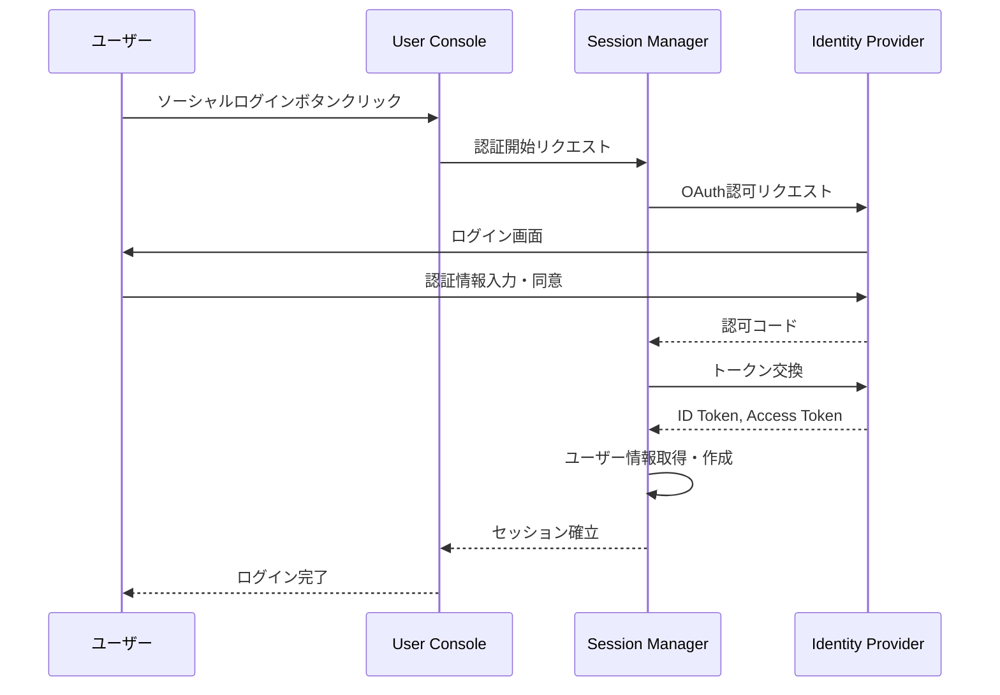

# Identity Provider インタラクション仕様書（itr-idp）

## ドキュメント管理情報

| 項目 | 値 |
|------|-----|
| Status | `reviewed` |
| Version | v2.0 |
| Note | Identity Provider Interaction Specification - 実装範囲外 |

---

## 概要

Identity Provider（IDP）は、ソーシャルログイン（Google, GitHub等）を提供する外部サービス。主にユーザー登録時のID発行を担う。

**実装範囲外**だが、他コンポーネントとのやり取りを明確にするため仕様を記載する。

---

## 連携サマリー（spc-itrより）

| 相手 | 方向 | やり取り |
|------|------|----------|
| Session Manager | IDP ← SSM | ソーシャルログイン |

---

## 連携詳細

### SSM → IDP（ソーシャルログイン）

| 項目 | 内容 |
|------|------|
| プロトコル | OAuth 2.0 / OpenID Connect |
| 用途 | ソーシャルログインによるユーザー認証 |

**対応プロバイダ:**
- Google
- Apple
- Microsoft
- GitHub

**フロー:**

---

## IDPが直接やり取りしないコンポーネント

| コンポーネント | 理由 |
|----------------|------|
| MCP Client (CLO/CLK) | MCP通信専用 |
| API Gateway (GWY) | MCP通信専用 |
| Auth Server (AUS) | OAuth 2.1専用（MCP Client向け） |
| User Console (CON) | SSM経由 |
| Data Store (DST) | SSM経由 |
| Token Vault (TVL) | 外部サービストークン専用 |
| Auth Middleware (AMW) | MCP Server内部 |
| MCP Handler (HDL) | MCP Server内部 |
| Modules (MOD) | MCP Server内部 |
| External Auth Server (EAS) | 外部サービス認証専用 |
| External Service API (EXT) | MOD経由 |
| Payment Service Provider (PSP) | 課金専用 |

---

## 関連ドキュメント

| ドキュメント | 内容 |
|-------------|------|
| [spc-sys.md](../spc-sys.md) | システム仕様書 |
| [spc-itr.md](../spc-itr.md) | インタラクション仕様書 |
| [itr-ssm.md](./itr-ssm.md) | Session Manager詳細仕様 |
