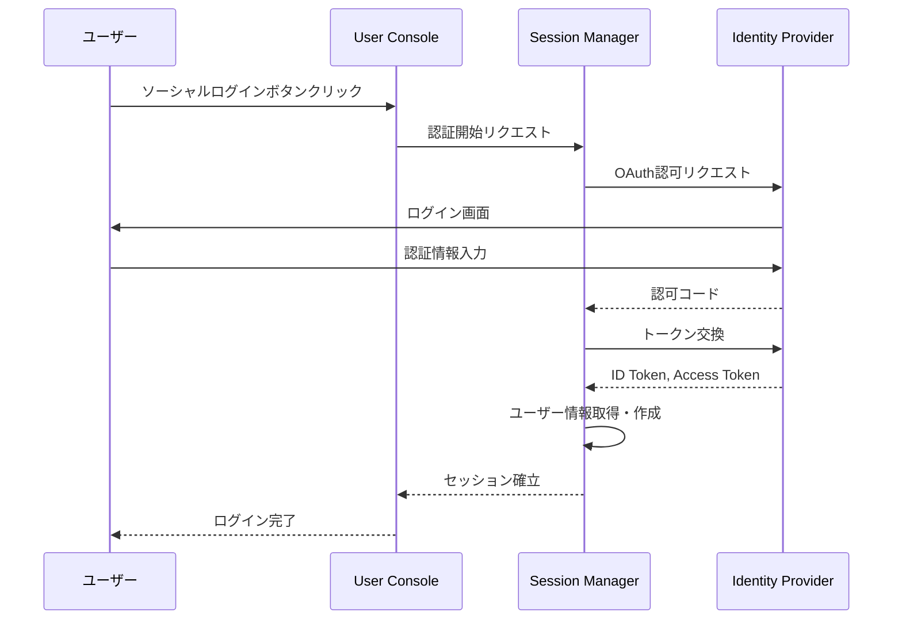

# Session Manager インタラクション仕様書（itr-ssm）

## ドキュメント管理情報

| 項目 | 値 |
|------|-----|
| Status | `reviewed` |
| Version | v2.0 |
| Note | Session Manager Interaction Specification |

---

## 概要

Session Manager（SSM）は、ユーザーセッションとソーシャルログイン連携を管理するコンポーネント。

主な責務：
- ソーシャルログイン連携（Google, GitHub等）
- ユーザーID発行
- セッション管理

**実装:** Supabase Auth

---

## 連携サマリー（spc-itrより）

| 相手 | 方向 | やり取り |
|------|------|----------|
| Auth Server | SSM ↔ AUS | ユーザー認証連携 |
| Identity Provider | SSM → IDP | ソーシャルログイン |
| Data Store | SSM → DST | ユーザーID共有 |

---

## 連携詳細

### AUS ↔ SSM（ユーザー認証連携）

| 項目 | 内容 |
|------|------|
| 用途 | OAuth 2.1認可フローにおけるユーザー認証 |
| トリガー | AUSの/authorizeリクエスト時 |
| 実装 | Supabase Auth内部処理（実装範囲外） |

**フロー:**
1. AUSが/authorizeリクエストを受信
2. SSMにセッション確認を依頼
3. 未ログインの場合、SSMのログインフローにリダイレクト
4. ログイン完了後、SSMがAUSにユーザー情報を返却
5. AUSが同意画面を表示し、認可コードを発行

**SSMがAUSに提供する情報:**
- user_id（UUID）
- email
- display_name

---

### SSM → IDP（ソーシャルログイン）

| 項目 | 内容 |
|------|------|
| プロトコル | OAuth 2.0 / OpenID Connect |
| 用途 | ソーシャルログインによるユーザー認証 |

**対応プロバイダ:**
- Google
- Apple
- Microsoft
- GitHub

**フロー:**


**SSMの処理:**
1. IDPから受け取ったID Tokenを検証
2. ユーザー情報（email, name等）を抽出
3. 既存ユーザーか確認
4. 新規の場合はユーザーレコード作成
5. セッショントークンを発行

---

### SSM → DST（ユーザーID共有）

| 項目 | 内容 |
|------|------|
| トリガー | 新規ユーザー登録時 |
| 操作 | ユーザーレコード作成 |

**フロー:**
1. SSMがソーシャルログインでユーザー認証
2. 新規ユーザーの場合、DSTにユーザーレコード作成
3. user_id（UUID）をシステム全体で共有

**ユーザーID形式:**
```
Supabase Auth UUID: xxxxxxxx-xxxx-xxxx-xxxx-xxxxxxxxxxxx
```

**作成されるユーザー情報:**
- user_id（UUID）
- email
- display_name
- created_at

---

## セッション管理

| 項目 | 値 | 備考 |
|------|-----|------|
| Access Token有効期限 | 3600秒（1時間） | Supabase Authデフォルト |
| Refresh Token有効期限 | 無期限 | 1回のみ使用可能 |
| セッション有効期限 | 無期限 | サインアウトまで有効 |
| 同時セッション数 | 無制限 | - |

**実装:** Supabase Auth設定（実装範囲外）

---

## SSMが直接やり取りしないコンポーネント

| コンポーネント | 理由 |
|----------------|------|
| MCP Client (OAuth2.0) (CLO) | AUS経由 |
| MCP Client (API KEY) (CLK) | TVL経由 |
| API Gateway (GWY) | MCP通信専用 |
| Token Vault (TVL) | 外部サービストークン専用 |
| Auth Middleware (AMW) | MCP Server内部 |
| MCP Handler (HDL) | MCP Server内部 |
| Modules (MOD) | MCP Server内部 |
| User Console (CON) | SSMのログインUIを表示（直接連携ではない） |
| External Auth Server (EAS) | 外部サービス認証専用 |
| External Service API (EXT) | MOD経由 |
| Payment Service Provider (PSP) | DST経由 |

---

## 関連ドキュメント

| ドキュメント | 内容 |
|-------------|------|
| [spc-sys.md](../spc-sys.md) | システム仕様書 |
| [spc-itr.md](../spc-itr.md) | インタラクション仕様書 |
| [itr-aus.md](./itr-aus.md) | Auth Server詳細仕様 |
| [itr-idp.md](./itr-idp.md) | Identity Provider詳細仕様 |
| [itr-dst.md](./itr-dst.md) | Data Store詳細仕様 |
| [itr-con.md](./itr-con.md) | User Console詳細仕様 |
