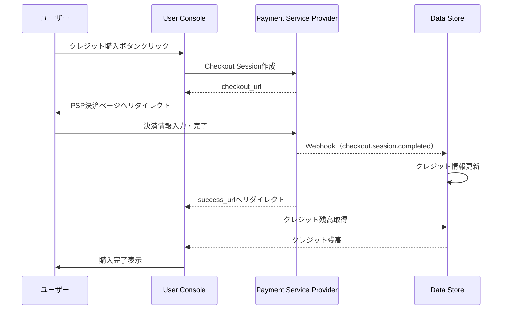
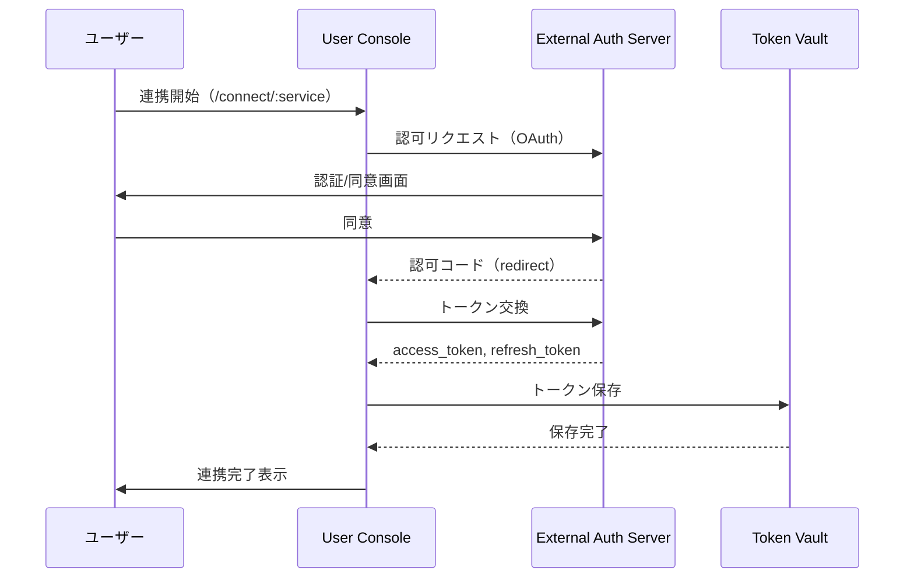
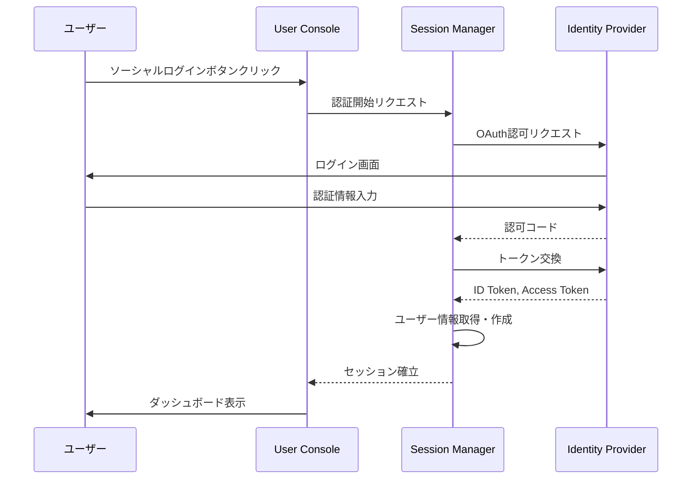

# User Console インタラクション仕様書（itr-con）

## ドキュメント管理情報

| 項目 | 値 |
|------|-----|
| Status | `draft` |
| Version | v2.0 |
| Note | User Console Interaction Specification |

---

## 概要

User Console（CON）は、ユーザーが自分の設定を管理するWebアプリケーション。

主な機能：
- ユーザー認証（ログイン/ログアウト）
- OAuth同意画面の提供（MCP Client認可時）
- 外部サービス連携（OAuth認可フロー）
- 権限設定（モジュール有効/無効）
- 課金管理
- サーバーへの接続情報の提供

---

## 連携サマリー（spc-itrより）

| 相手 | 方向 | やり取り |
|------|------|----------|
| Payment Service Provider | CON → PSP | 決済リクエスト |
| Token Vault | CON → TVL | トークン登録 |
| Data Store | CON → DST | ツール設定登録 |
| External Auth Server | CON → EAS | 認可フロー |
| Session Manager | CON → SSM | ソーシャルログイン |

---

## 連携詳細

### CON → PSP（決済リクエスト）

| 項目 | 内容 |
|------|------|
| プロトコル | HTTPS |
| 用途 | クレジット購入、課金管理 |

**フロー:**


---

### CON → TVL（トークン登録）

| 項目 | 内容 |
|------|------|
| 用途 | 外部サービスのトークン保存 |
| タイミング | OAuth連携完了時、または手動トークン登録時 |

**登録リクエスト:**
```json
{
  "user_id": "user-123",
  "service_id": "notion",
  "auth_type": "bearer",
  "credentials": { ... }
}
```

| フィールド | 必須 | 説明 |
|-----------|------|------|
| user_id | ✅ | ユーザーID |
| service_id | ✅ | サービス識別子 |
| auth_type | ✅ | 認証方式（bearer, oauth1, basic, custom_header） |
| credentials | ✅ | auth_typeに応じた認証情報 |

credentialsの詳細は[itr-tvl.md](./itr-tvl.md)を参照。

---

### CON → DST（ツール設定登録）

| 項目 | 内容 |
|------|------|
| 用途 | ユーザー設定の管理 |
| 操作 | モジュール有効/無効、ツール設定変更 |

**管理対象の設定：**

| 設定 | 説明 | 操作 |
|------|------|------|
| enabled_modules | ユーザーが有効化したモジュール一覧 | 登録/更新 |
| tool_settings | モジュール内の個別ツールの有効/無効設定 | 登録/更新 |
| user_prompts | ユーザー定義プロンプト | 登録/更新/削除 |
| credit_balance | クレジット残高 | 参照のみ |
| account_status | アカウント状態（active/suspended/disabled） | 参照のみ |
| usage_stats | 利用統計（モジュール別/期間別の消費量等） | 参照のみ |

---

### CON → EAS（認可フロー）

| 項目 | 内容 |
|------|------|
| プロトコル | OAuth 2.0 |
| 用途 | 外部サービスへのアクセス権限取得 |

**フロー:**


**主な対応サービス：**
- Notion
- Google Calendar
- Microsoft To Do

---

### CON → SSM（ソーシャルログイン）

| 項目 | 内容 |
|------|------|
| プロトコル | OAuth 2.0 / OpenID Connect（SSM経由） |
| 用途 | ユーザーログイン |

CONはSSMを経由してIDPと通信する。CONとIDPの直接通信はない。

**フロー:**


**対応プロバイダ:**
- Google
- Apple
- Microsoft
- GitHub

---

## CONが直接やり取りしないコンポーネント

| コンポーネント | 理由 |
|----------------|------|
| MCP Client (OAuth2.0) (CLO) | 別アプリケーション |
| MCP Client (API KEY) (CLK) | 別アプリケーション |
| API Gateway (GWY) | MCP通信専用 |
| Auth Server (AUS) | CLO向け認証（CONはSSM経由） |
| Auth Middleware (AMW) | MCP Server内部 |
| MCP Handler (HDL) | MCP Server内部 |
| Modules (MOD) | MCP Server内部 |
| Identity Provider (IDP) | SSM経由 |
| External Service API (EXT) | EAS経由 |

---

## 関連ドキュメント

| ドキュメント | 内容 |
|-------------|------|
| [spc-sys.md](../spc-sys.md) | システム仕様書 |
| [spc-itr.md](../spc-itr.md) | インタラクション仕様書 |
| [itr-psp.md](./itr-psp.md) | Payment Service Provider詳細仕様 |
| [itr-tvl.md](./itr-tvl.md) | Token Vault詳細仕様 |
| [itr-dst.md](./itr-dst.md) | Data Store詳細仕様 |
| [itr-eas.md](./itr-eas.md) | External Auth Server詳細仕様 |
| [itr-ssm.md](./itr-ssm.md) | Session Manager詳細仕様 |
