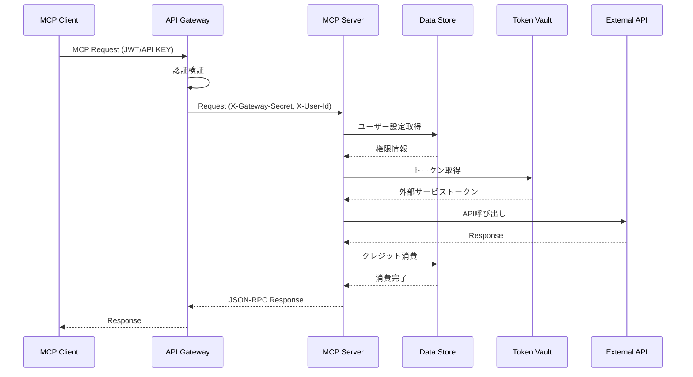

# MCP Server インタラクション仕様書（itr-srv）

## ドキュメント管理情報

| 項目 | 値 |
|------|-----|
| Status | `draft` |
| Version | v3.1 |
| Note | MCP Server Interaction Specification |

---

## 概要

MCP Server（SRV）は、MCP Clientからのリクエストを受け付けるサーバー。外部からは単一のコンポーネントとして見えるが、内部は複数のコンポーネントで構成される。

**内部コンポーネント:**
- Auth Middleware（AMW）
- MCP Handler（HDL）
- Modules（MOD）

主な責務：
- MCP Protocolリクエストの受付
- 認証・認可の実行
- ツール/リソース/プロンプトの提供
- 外部サービスとの連携

---

## 連携サマリー（spc-itrより）

| 相手 | 方向 | やり取り |
|------|------|----------|
| API Gateway | SRV ← GWY | リクエスト受付（Auth Middleware経由） |

外部コンポーネントからはSRVとして抽象化される。内部コンポーネント間の詳細は各仕様書を参照。

---

## 連携詳細

### GWY → SRV（リクエスト受付）

| 項目 | 内容 |
|------|------|
| プロトコル | HTTP（内部通信） |
| 認証 | X-Gateway-Secret ヘッダー（GWYで検証済み） |
| エントリーポイント | Auth Middleware（AMW） |

**リクエストフロー:**


---

## Protected Resource Metadata

MCP Clientが初回認可フローで参照するメタデータ（[RFC 9728](https://datatracker.ietf.org/doc/html/rfc9728) 準拠）。

**エンドポイント:** `{MCP Server Domain}/.well-known/oauth-protected-resource`

**レスポンス:**
```json
{
  "resource": "{MCP Server URL}",
  "authorization_servers": ["{Auth Server URL}"],
  "scopes_supported": ["openid", "profile", "email"],
  "bearer_methods_supported": ["header"]
}
```

---

## MCP Protocol

[MCP Protocol 2025-11-25](https://modelcontextprotocol.io/specification/2025-11-25) 準拠。

### サポートするメソッド

| メソッド | 説明 | 処理担当 |
|----------|------|----------|
| initialize | セッション初期化 | HDL |
| ping | ヘルスチェック | HDL |
| tools/list | ツール一覧取得 | HDL（メタツール返却） |
| tools/call | ツール実行 | HDL → MOD |
| resources/list | リソース一覧取得 | HDL → MOD |
| resources/read | リソース取得 | HDL → MOD |
| prompts/list | プロンプト一覧取得 | HDL → MOD |
| prompts/get | プロンプト取得 | HDL → MOD |

### リクエスト形式

```
POST {MCP Server Domain}/mcp
Authorization: Bearer {access_token}
Content-Type: application/json
Accept: application/json, text/event-stream
MCP-Protocol-Version: 2025-11-25
MCP-Session-Id: {session_id}
```

### レスポンス形式

```
Content-Type: application/json または text/event-stream
MCP-Session-Id: {session_id}
```

---

## 内部処理フロー

SRV内部では以下の順序でリクエストを処理する。

| 順序 | コンポーネント | 処理内容 | 詳細仕様 |
|------|----------------|----------|----------|
| 1 | AMW | X-Gateway-Secret検証 | [itr-amw.md](./itr-amw.md) |
| 2 | HDL | JSON-RPC解析、権限確認、ルーティング | [itr-hdl.md](./itr-hdl.md) |
| 3 | MOD | 外部サービス連携、プリミティブ提供 | [itr-mod.md](./itr-mod.md) |

**処理の流れ:**
1. **AMW**: GWYからのリクエストを受信し、X-Gateway-Secretを検証。検証成功時のみHDLへ転送
2. **HDL**: JSON-RPCを解析し、DSTからユーザー権限を取得。アカウント状態・クレジット・モジュール有効性を確認後、MODにプリミティブ操作を委譲
3. **MOD**: 外部サービスAPIを呼び出し、結果をHDLへ返却。ツール実行成功時はDSTにクレジット消費を記録

---

## SRVが直接やり取りしないコンポーネント

| コンポーネント | 理由 |
|----------------|------|
| MCP Client (OAuth2.0) (CLO) | GWY経由 |
| MCP Client (API KEY) (CLK) | GWY経由 |
| Auth Server (AUS) | GWY経由（JWKS取得） |
| Session Manager (SSM) | DST経由 |
| Token Vault (TVL) | MOD経由 |
| User Console (CON) | 別アプリケーション |
| Identity Provider (IDP) | SSM経由 |
| External Auth Server (EAS) | CON経由 |
| Payment Service Provider (PSP) | DST経由 |

---

## 関連ドキュメント

| ドキュメント | 内容 |
|-------------|------|
| [spc-sys.md](../spc-sys.md) | システム仕様書 |
| [spc-itr.md](../spc-itr.md) | インタラクション仕様書 |
| [itr-gwy.md](./itr-gwy.md) | API Gateway詳細仕様 |
| [itr-amw.md](./itr-amw.md) | Auth Middleware詳細仕様 |
| [itr-hdl.md](./itr-hdl.md) | MCP Handler詳細仕様 |
| [itr-mod.md](./itr-mod.md) | Modules詳細仕様 |
| [itr-clo.md](./itr-clo.md) | MCP Client (OAuth2.0)詳細仕様 |
